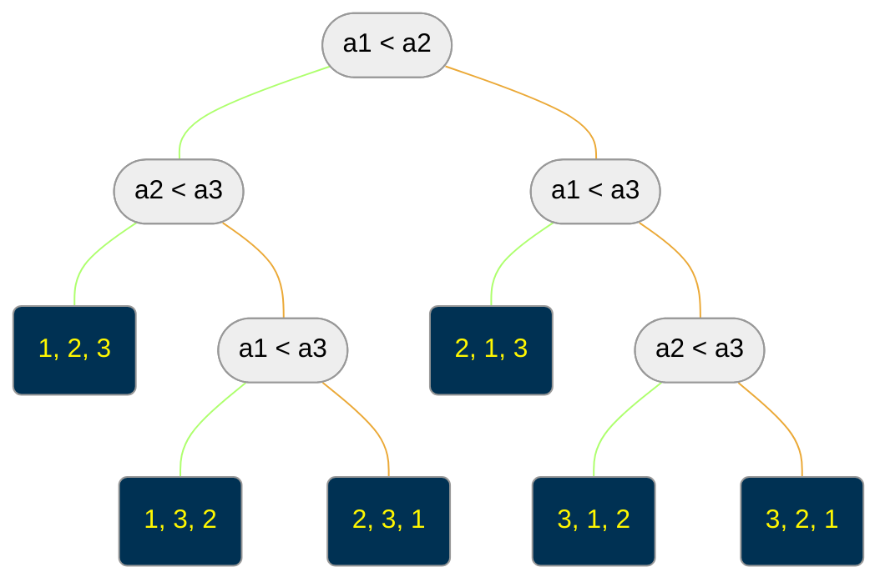

# Lower Bounds on Sorting
## Can we sort in $o(n\lg{n})$?
- Any comparison-based sorting program can be thought of as defining a decision tree of possible executions.
- Running the same program twice on the same permutation causes it to do exactly the same thing, but running it on different permutations of the same data causes a different sequence of comparisons to be made on each.

**Claim**: the height of this decision tree is the worst-case complexity of sorting.
  

## Lower Bound Analysis
- Since any two different permutations of $n$ elements requires a different sequence of steps to sort, there must be at least $n!$ different paths from the root to leaves in the decision tree.
- Thus there must be at least $n!$ different leaves in this binary tree.
- Since a binary tree of height $h$ has at most $2^h$ leaves, we know $n!\le 2^h$, or $h\ge \lg{(n!)}$.
- By inspection $n! \gt (n / 2)^{n / 2}$, since the last $n / 2$ terms of the product are each greater than $n / 2$. Thus
$$\log{(n!)}\gt\log{((n / 2)^{n / 2})}=n / 2\log{(n / 2)}\to\Theta{(n\log{n})}$$
  

## Stirling's Approximation
By Stirling's approximation, a better bound is $n!\gt (n / e)^{n}$ where $e = 2.718$.
$$h\ge\lg{(n/e)^n} = n\lg{n} - n\lg{e} = \Omega{(n\lg{n})}$$
  

# Bucketsort: Non-Comparison-Based Sorting
## Non-Comparison-Based Sorting
- All the sorting algorithms we have seen assume binary comparisons as the basic primative, questions of the form "is $x$ before $y$?".
- But how would you sort a deck of playing cards?
- Most likely you would set up 13 piles and put all cards with the same number in one pile.
- With only a constant number of cards left in each pile, you can use insertion sort to order by suite and concatenate everything together.
- If we could find the correct pile for each card in constant time, and each pile gets $O(1)$ cards, this algorithm takes $O(n)$ time.
  

## Bucketsort
- Suppose we are sorting $n$ numbers from $1$ to $m$, where we know the numbers are approximately uniformly distributed.
- We can set up $n$ buckets, each responsible for an interval of $m / n$ numbers from $1$ to $m$.
- Given an input number $x$, it belongs in bucket number $\lceil xn / m\rceil$.
- If we use an array of buckets, each item gets mapped to the right bucket in $O(1)$ time.
  

## Bucketsort Analysis
- With uniformly distributed keys, the expected number of items per bucket is $1$. Thus sorting each bucket takes $O(1)$ time.
- The total effort of bucketing, sorting buckets, and concatenating the sorted buckets together is $O(n)$.
  

## Non-Comparison Sorts Don't Beat the Bound
- Radix sort works by partitioning on the lowest order characters first, maintaining this order to break ties.
- It takes time $O(mn)$ to sort $n$ strings of length $m$, or time *linear* in the input size!
- But $m$ must be $\Omega{(\log{n})}$ before the strings are all distinct.
- Sorting $n$ arbitrary, distinct keys cannot be done better than $\Theta{(n\log{n})}$.
  