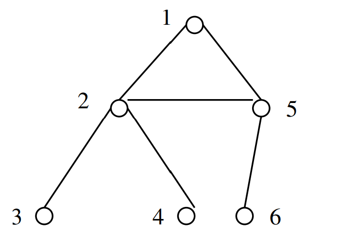

# Depth-First Search
- DFS has a neat recursive implementation which eliminates the need to explicitly use a stack.
- Discovery and final times are a convenience to maintain.
```c
void dfs(graph *g, int v) {
    edgenode *p;       /* temporary pointer */
    int y;             /* successor vertex */

    if (finished) {
        return;        /* allow for search termination */
    }

    discovered[v] = true;
    time = time + 1;
    entry_time[v] = time;

    process_vertex_early(v);

    p = g->edges[v];
    while (p != NULL) {
        y = p->y;
        if (!discovered[y]) {
            parent[y] = v;
            process_edge(v, y);
            dfs(g, y);
        } else if (((!processed[y]) && (parent[v] != y)) || (g->directed)) {
            processed_edge(v, y);
        }

        if (finished) {
            return;
        }

        p = p->next;
    }

    process_vertex_late(v);

    time = time + 1;
    exit_time[v] = time;

    processed[v] = true;
}
```
<br></br>

## Backtracking and Depth-First Search
- Depth-First search uses essentially the same idea as backtracking.
- Both involve exhaustively searching all possibilities by advancing if it is possible, and backing up as soon as there is no unexplored possibility for further advancement.
- Both are most easily understood as recursive algorithms.
<br></br>

## The *key* Idea with DFS
- A depth-first search of a graph organizes the edges of the graph in a precise way.
- In a DFS of an undirected graph, we assign a direction to each edge, from the vertex which discover it:

<center></center>

<br></br>

## Edge Classification for DFS
Every edge is either:

<center></center>


On any particular DFS or BFS of a directed or undirected graph, each edge gets classified as one of the above.
<br></br>

## Edge Classification Implementation
```c
int edge_classification(int x, int y) {
    if (parent[y] == x) {
        return (TREE);
    }

    if (discovered[y] && !processed[y]) {
        return (BACK);
    }

    if (processed[y] && (entry_time[y] > entry_time[x])) {
        return (FORWARD);
    }

    if (processed[y] && (entry_time[y] < entry_time[x])) {
        return (CROSS);
    }

    printf("Warning: self loop (%d, %d)\n", x, y);

    return -1;
}
```
<br></br>

## DFS: Tree Edges and Back Edges Only
- The reason DFS is so important is that it defines a very nice ordering to the edges of the graph.
- In a DFS of an undirected graph, every edge is either a tree edge or a back edge.
<br></br>

## No Cross Edges in DFS
Suppose we have a cross-edge
<center></center>

When expanding 2, we would discover 5, so the treww would look like:

<center></center>
<br></br>

# Applications of DFS: Finding Cycles and Articulation Vertices
## DFS Application: Finding Cycles
- Back edges are the key to finding a cycle in an undirected graph.
- Any back edge going from $x$ to an ancestor $y$ creates a cycle with the path in the tree from $y$ to $x$.

```c
void process_edge(int x, int y) {
    if (parent[y] != x) {  /* found back edge! */
        printf("Cycle from %d to %d:", y, x);
        find_path(y, x, parent);
        finished = true;
    }
}
```
<br></br>

## Articulation Vertices

<center></center>

- An *articulation vertex* is a vertex of a connected graph whose deletion disconnects the graph.
- Clearly connectivity is an important concern in the design of any network.
- Articulation vertices can be found in $O(n(m + n))$ - just delete each vertex to do a DFS on the remaining graph to see if it is connected.
<br></br>

## A Faster $O(n + m)$ DFS Algorithm
In a DFS tree, a vertex $v$ (other than the root) is an articulation vertex iff $v$ is not a leaf and some subtree of $v$ has no back edge incident until a proper ancestor of $v$.

<center></center>
<br></br>

# Topological Sorting
- A directed, acyclic graph has no directed cycles.

<center></center>

- A topological sort of a graph is an ordering on the vertices so that all edges go from left to right.
- DAGs (and only DAGs) has at least one topological sort (here $G, A, B, C, F, E, D$)
<br></br>

## Applications of Topological Sorting
- Topological sorting is often useful in scheduling jobs in their proper sequence.
- In general, we can use it to order things given precedence constraints.
<br></br>

## Topological Sorting via DFS
- A directed graph is a DAG iff no back edges are encountered during a depth-first search.
- Labeling each of the vertices in the reverse order that they are marked *processed* finds a topological sort of a DAG.
- Why? Consider what happens to each directed edge ${x, y}$ as we encounter it during the exploration of vertex $x$.
<br></br>

## Case Analysis
- If $y$ is currently *undiscovered*, then we then start a DFS of $y$ before we can continue with $x$. Thus $y$ is marked *completed* before $x$ is, and $x$ appears before $y$ in the topological order, as it must.
- If $y$ is *discovered* but not *completed*, then ${x, y}$ is a back edge, which is forbidden in a DAG.
- If $y$ is *completed*, then it will have been so labeled before $x$. Therefore, $x$ appears before $y$ in the topological order, as it must.
<br></br>

## Topological Sorting Implementation
```c
void process_vertex_late(int v) {
    push(&sorted, v);
}

void process_edge(int x, int y) {
    int class;    /* edge class */

    class = edge_classification(x, y);

    if (class == BACK) {
        printf("Warning: directed cycle found, not a DAG\n");
    }
}

void topsort(graph *g) {
    int i;    /* counter */

    init_stack(&sorted);

    for (i = 1, i <= g->nvertices; i++) {
        if (!discovered[i]) {
            dfs(g, i);
        }
    }
    print_stack(&sorted);    /* report topological order */
}
```
- We push each vertex on a stack soon as we have evaluated all outgoing edges. The top vertex on the stack always has no incoming edges from any vertex on the stack, repeatedly popping them off yields a topological ordering.
<br></br>

## Topological Sorting by Indegree-0 Node Removal
```c
void topsort(graph *g, int sorted[]) {
    int indegree[MAXV + 1];  /* indegree of each vertex */
    queue zeroin;            /* vertices of indegree 0 */
    int x, y;                /* current and next vertex */
    int i, j;                /* counters */
    edgenode *p;             /* temporary pointer */

    compute_indegrees(g, indegree);
    init_queue(&zeroin);
    for(i = 1; i <= g->nvertices; i++) {
        if (indegree[i] == 0) {
            enqueue(&zeroin, i);
        }
    }

    j = 0;
    while (!empty_queue(&zeroin)) {
        j = j + 1;
        x = dequeue(&zeroin);
        sorted[j] = x;
        p = g->edges[x];
        while (p != NULL) {
            y = p->y;
            indegree[y]--;
            if (indegree[y] == 0) {
                enqueue(&zeroin, y);
            }
            p = p->next;
        }
    }

    if (j != g->nvertices) {
        printf("Not a DAG -- only %d vertices found\n", j);
    }
}

void compute_indegrees(graph *g, int in[]) {
    int i;        /* counter */
    edgenode *p;  /* temporary pointer */

    for (i = 1; i <= g->nvertices; i++) {
        in[i] = 0;
    }

    for (i = 1; i <= g->nvertices; i++) {
        p = g->edges[i];
        while (p != NULL) {
            in[p->y]++;
            p = p->next;
        }
    }
}
```
<br></br>

# Applications of DFA: Strongly Connected Components
- A directed graph is strongly connected iff there is a directed path between any two vertices.
- The strongly connected componenets of a graph is a partition of the vertices into subsets (maximal) such that each subset is strongly connected.
- Observe that no vertex can be in two maximal components, so it as a partition.

<center></center>

- There is an elegant, linear time algorithm find the strongly connected components of a directed graph using DFS which is similar to the algorithm for biconnected components.