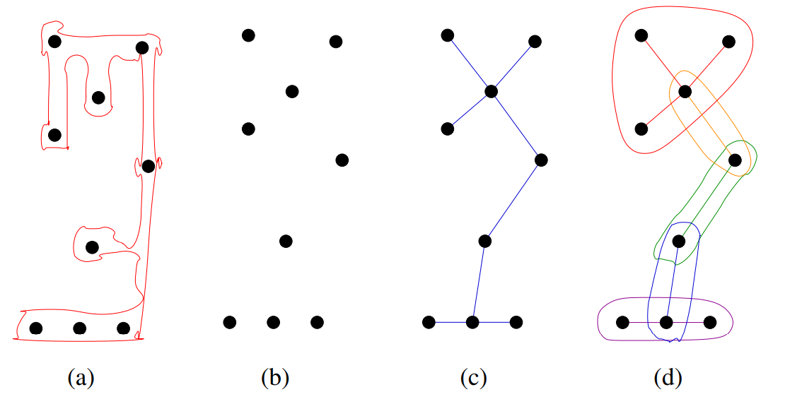
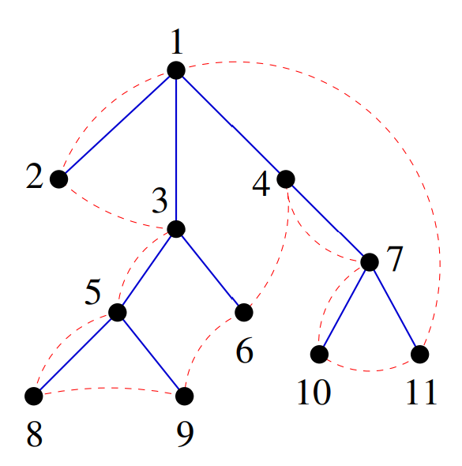
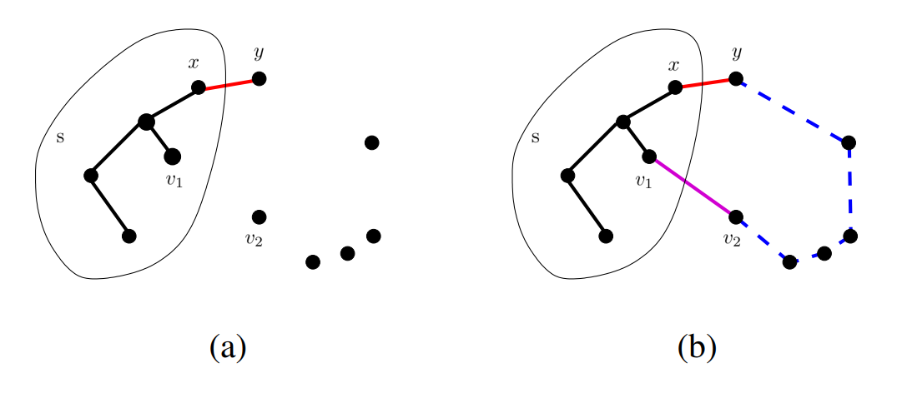
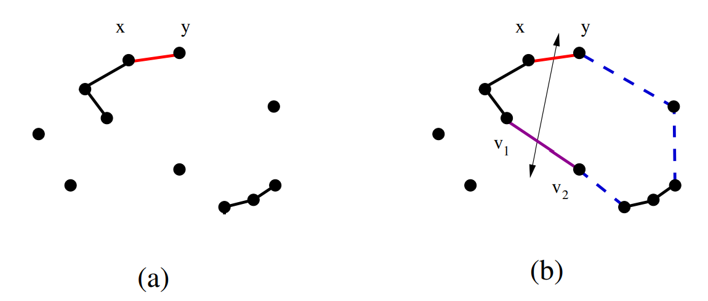
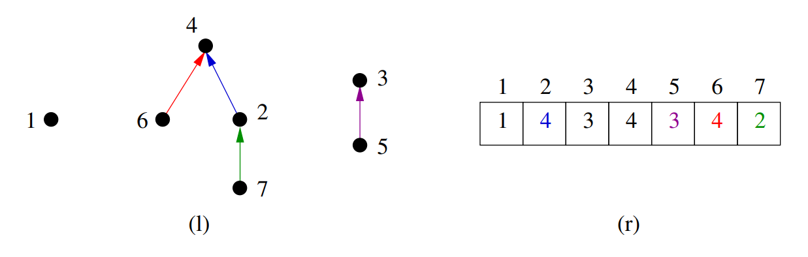
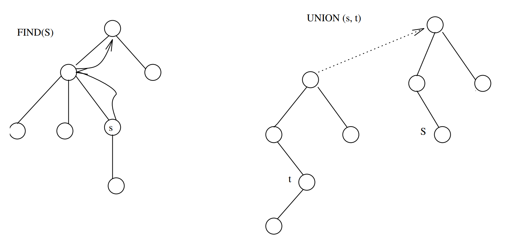
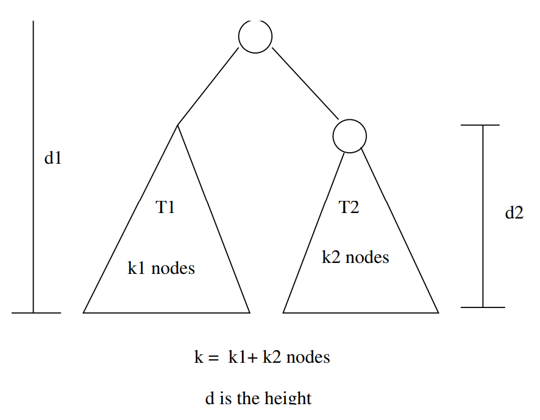

# Minimum Spanning Trees
## Weighted Graph Algorithms
- Beyond DFS/BFS exists an alternate universe of algorithms for *edge-weighted graphs*.
- Our adjacency list representation quietly supported these graphs:
```c
typedef struct edgenode {
    int y;                     /* adjacency info */
    int weight;                /* edge weight, if any */
    struct edgenode *next;     /* next edge in list */
} edgenode;

typedef struct {
    edgenode *edges[MAXV + 1]; /* adjacency info*
    int degree[MAXV + 1];      /* outdegree of each vertex */
    int nvertices;             /* number of vertices in the graph */
    int nedges;                /* number of edges in the graph */
    int directed;              /* is the graph directed? */
} graph;
```
<br></br>

## Minimum Spanning Trees
- A tree is a connected graph with no cycles. A spanning tree is a subgraph of $G$ which has the same set of vertices of $G$ and is a tree.
- A *minimum spanning tree* of a weighted graph $G$ is the spanning tree of $G$ whose edges sum to minimum weight.
- There can be more than one minimum spanning tree in a graph $\to$ consider a graph with identical weight edges.
<br></br>

## Why Minimum Spanning Trees?
- The minimum spanning tree problem has a long history - the first algorithm dates back to 1926.
- MST is taught in algorithm course because:
    - It aries in many graph applications.
    - It is problem where the *greedy* algorithm always give the optimal answer.
    - Clever data structures are necessary to make it work.
- Greedy algorithms make the decision of what next to do by selecting the best *local* option from all available choices.
<br></br>

## Applications of Minimum Spanning Trees
- Minimum spanning trees are useful in constructing networks, by describing the way to connect a set of sites using the smallest total amount of wire.
- Minimum spanning trees provide a reasonable way for *clustering* points in space into natural groups.
<br></br>

### Minimum Spanning Trees and Net Partitioning
- One of the war stories in the text describes how to partition a graph into compact subgraphs by deleting large edges from the minimum spanning tree.

<center></center>

<br></br>

### Minimum Spanning Trees and TSP
For points in the Euclidean plane, MST yield a good heuristic for the traveling salesman problem:

<center></center>

The optimum traveling salesman tour is a most twice the length of the minimum spanning tree.
<br></br>

# Prim's Algorithm
- Prim's algorithm starts from one vertex and grows the rest of the tree an edge at a time.
- As a greedy algorithm, which edge should we pick?
- The cheapest edge with which can grow the tree by one vertex without creating a cycle.
<br></br>

## Prim's Algorithm(Pseudocode)
During execution each vertex $v$ is either in thre tree, *fringe* (meaning there exists an edge from a tree vertex to $v$) or *unseen* (meaning $v$ is more than one edge away).

$\texttt{Prim-MST(G)}$<br>
$\qquad\texttt{Select an arbitrary vertex } s \texttt{ to start the tree form.}$<br>
$\qquad\texttt{While (there are still non-tree vertices)}$<br>
$\qquad\qquad\texttt{Pick min cost edge between tree/non-tree vertices}$
$\qquad\qquad\texttt{Add the selected edge and vertex to the tree } T_{prim}.$

This creates a spanning tree, since no cycle can be introduced.
<br></br>

## Why is Prim Correct?
- If Prim's algorithm is not correct, these must be some graph $G$ where it does not give the minimum cost spanning tree.
- If so, there must be a first edge $(x, y)$ Prim adds, such that the partial tree $V'$ cannot be extended into a MST.

<center></center>

<br></br>

## The Contradiction
- But if $(x, y)$ is not in $MST(G)$, then there must be a path in $MST(G)$ from $x$ to $y$, because the tree is connected.
- Let $(v_1, v_2)$ be the other edge on this path with one end in $V'$.
- Replacing $(v_1, v_2)$ with $(x, y)$ we get a spanning tree with smaller weight, since $W(v, w) > W(x, y)$.
- If $W(u, v) = W(x, y)$, then the tree is the same weight, but we couldn't have made a fatal mistake picking $(x, y)$.
- Thus Prim's algorithm is correct.
<br></br>

## How Fast is Prim's Algorithm?
- That depends on what data structures are used. In the simplest implementation, we can simply mark each vertex as tree and non-tree and search always from scratch:

$\texttt{Select an arbitrary vertex to start}$<br>
$\texttt{While (there are non-tree vertices)}$<br>
$\qquad\texttt{select minimum weight edge between tree and fringe}$<br>
$\qquad\texttt{add the selected edge and vertex to the tree}$

This can be done in $O(nm)$ time, by doing a DFS or BFS to loop through all edges, with a constant time test per edge, and a total of $n$ insertions.
<br></br>

## Prim's Implementation
To do it faster, we must identify fringe vertices and the minimum cost edge associated with it fast.

```c
int prim(graph *g, int start) {
    int i;                   /* counter */
    edgenode *p;             /* temporary pointer */
    bool intree[MAXV + 1];   /* is the vertex in the tree yet? */
    int distance[MAXV + 1];  /* cost of adding to tree */
    int v;                   /* current vertex to process */
    int w;                   /* candidate next vertex */
    int dist;                /* cheapest cost to enlarge tree */
    int weight = 0;          /* tree weight */

    for (i = 1; i <= g->nvertices; i++) {
        intree[i] = false;
        distance[i] = MAXINT;
        parent[i] = -1;
    }

    distance[start] = 0;
    v = start;

    while(!intree[v]) {
        intree[v] = true;
        if (v != start) {
            printf("edge (%d, %d) in tree\n", parent[v], v);
            weight = weight + dist;
        }
        p = g->edges[v];
        while (p != NULL) {
            w = p->y;
            if ((distance[w] > p->weight) && (!intree[w])) {
                distance[w] = p->weight;
                parent[w] = v;
            }
            p = p->next;
        }

        dist = MAXINT;
        for (i = 1; i <= g->nvertices; i++) {
            if ((!intree[i]) && (dist > distance[i])) {
                dist = distance[i];
                v = i;
            }
        }
    }

    return (weight);
}
```
<br></br>

## Prim's Analysis
- Finding the minimum weight fringe-edge takes $O(n)$ time, because we iterate through the *distance* array to find the minimum.
- After adding a vertex $v$ to the tree, by running through its adjacency list in $O(n)$ time we check whether it provides a cheaper way to connect its neighbors to the tree. If so, update the *distance* value.
- The total time is $n \times O(n) = O(n^2)$.
<br></br>

# Kruskal's Algorithm
- Since an easy lower bound argument shows that everyedge must be looked at to find the minimum spanning tree, and the number of edges $m = O(n^2)$, Prim's algorithm is optimal on dense graphs.
- The complexity of Prim's algorithm is independent of the number of edges. Kruskal's algorithm is faster on sparse graphs.
- Kruskal's algorithm is also greedy. It repeatedly adds the smallest edge to the spanning tree that does not create a cycle.
<br></br>

## Kruskal is Correct
- If Kruskal's algorithm is not correct, these must be some graph $G$ where it does not give the minimum cost spanning tree.
- If so, there must be a first edge $(x, y)$ Kruskal adds such that the set of edges cannot be extended into a minimum spanning tree.
- When we added $(x, y)$ there no path between $x$ and $y$, or it would have created a cycle. Thus adding $(x, y)$ to the optimal tree it must create a cycle.
- But at least one edge in this cycle must have been added after $(x, y)$, so it must have heavier.
<br></br>

## The Contradiction
Deleteing this heavy edge leaves a better MST than the optimal tree, yielding a contradiction.

<center></center>

Thus Kruskal's algorithm is correct.
<br></br>

## How fast is kruskal's algorithm?
- What is the simplest implementation?
    - Sort the $m$ edges in $O(m\lg{m})$ time.
    - For each edge in order, test whether it creates a cycle the forest we have thus far built - if so discard, else add to forest. With a BFS/DFS, this can be done in $O(n)$ time (since the tree has at most $n$ edges).
- The total time is $O(mn)$.
<br></br>

## Fast Component Tests Give Fast MST
- Kruskal's algorithm builds up connected components. Any edge where both vertices are in the same connected component create a cycle. Thus if we can maintain which vertices are in which component fast, we do not have test for cycles.
    - *Same component* $(v_1, v_2)$ - Do vertices $v_1$ and $v_2$ lie in the same connected component of the current graph?
    - *Merge components* $(C_1, C_2)$ - Merge the given pair of connected components into one component.
<br></br>

## Fast Kruskal Implementation
$\texttt{Put the edges in a heap}$<br>
$count = 0$<br>
$\texttt{while } (count < n - 1) \texttt{ do}$<br>
$\qquad\texttt{get next edge } (v, w)$<br>
$\qquad\texttt{if (component(v)} \ne \texttt{component(w))}$<br>
$\qquad\qquad\texttt{add to T}$<br>
$\qquad\qquad\texttt{component(v)} = \texttt{component(w)}$

If we can test components in $O(\log{n})$, we can find the MST in $O(m\log{m})$!
<br></br>

# The Union-Find Data Structure
## Union-Find Programs
- We need a data structure for maintaining sets which can test if two elements are in the same and merge two sets together.
- These can be implemented by *union* and *find* operations,where
    - $\texttt{Find(i)}$ - Return the label of the root of tree containing element $i$, by walking up the parent pointers until there is no where to go.
    - $\texttt{Union(i, j)}$ - Link the root of one of the trees (say containing $i$) to the root of the tree containing the other (say $j$) so $find(i)$ now equals $find(j)$.
<br></br>

## Union-Find "Trees"
- We are interested in minimizing the time it takes to execute *any* sequence of unions and finds.
- A simple implementation is to represent each set as a tree, with pointers from a node to its parent. Each element is contained in a node, and the *name* of the set is the key at the root:

<center></center>

<br></br>

## Union-Find Data Structure
```c
typedef struct {
    int p[SET_SIZE + 1];     /* parent element */
    int size[SET_SIZE + 1];  /* number of elements in subtree */
    int n;                   /* number of elements in set */
} union_find;

void union_find_init(union_find *s, int n) {
    int i;    /* counter */

    for (i = 1; i <= n; i++) {
        s->p[i] = i;
        s->size[i] = 1;
    }
    s->n = n;
}
```
<br></br>

## Worst Case for Union Find
In the worst case, these structures can be very unbalanced:

$\texttt{For } i = 1 \texttt{ to } n / 2 \texttt{ do}$<br>
$\qquad\texttt{Union(i, i + 1)}$<br>
$\texttt{For } i = 1 \texttt{ to } n / 2 \texttt{ do}$<br>
$\qquad\texttt{Find(1)}$
<br></br>

## Who's The Parent?
- We want the limit the height of our trees which are affected by *union*'s.
- When we union, we can make the tree with fewer nodes the child.

<center></center>

- Since the number of nodes is related to the height,the height of the final tree will increase only if both subtrees are of equal height.
- If $Union(t, v)$ attaches the root of $v$ as a subtree of $t$ iff the number of nodes in t is greater than or equal to the number in $v$, after any sequence of unions, any tree with $h / 4$ nodes has height at most $\lfloor\lg{h}\rfloor$.
<br></br>

## Proof
- By induction on the number of nodes $k, k = 1$ has height $0$.
- Let $d_i$ be the height of the tree $t_i$.

<center></center>

- If $(d_1 > d_2)$ then $d = d_1\le\lfloor\log{k_1}\rfloor\le\lfloor\lg{(k_1 + k_2)}\rfloor = \lfloor\log{k}\rfloor$
- If $(d_1 \le d_2)$, then $k_1 \ge k_2$,<br>
$d = d_2 + 1 \le\lfloor\log{k_2}\rfloor + 1 = \lfloor\log{2k_2}\rfloor\le\lfloor\log{(k_1 + k_2)}\rfloor = \log{k} $
<br></br>

## Same Component Test
```c
bool same_component(union_find *s, int s1, int s2) {
    return (find(s, s1) == find(s, s2));
}

int find(union_find *s, int x) {
    if (s->p[x] == x) {
        return x;
    }
    return (find(s, s->p[x]));
}
```
<br></br>

## Merge Components Operation
```c
void union_sets(union_find *s, int s1, int s2) {
    int r1, r2;  /* roots of sets */

    r1 = find(s, s1);
    r2 = find(s, s2);

    if (r1 == r2) {
        return;  /* already in same set */
    }

    if (s->size[r1] >= s->size[r2]) {
        s->size[r1] = s->size[r1] + s->size[r2];
        s->p[r2] = r1;S
    } else {
        s->size[r2] = s->size[r1] + s->size[r2];
        s->p[r2] = r2;
    }
}
```