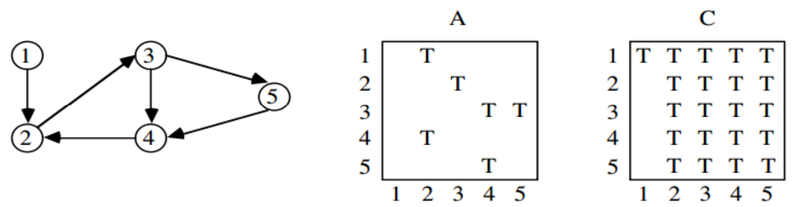

# Shortest Paths
## Applications for Shortest Paths
Finding the shortest path between two nodes in a graph arises in many different applications:
    - Transportation problems - finding the cheapest way to travel between two locations.
    - Motion planning - What is the most natural way for a cartoon character to move about a simulated environment.
    - Communications problems - how look will it take for a message to get between two places? Which two locations are furthest apart, ie. what is the *diameter* of the network.
<br></br>

## Shortest Paths and Sentence Disambiguation
- In our work on reconstructing text typed on an (overloaded) telephone keypad, we had to select which of many possible interpretations was most likely.
- We constructed a graph where the vertices were the possible words/positions in the sentence, with an edge between possible neighboring words.
- The final system identified over 99% of characters correctly based on grammatical and statistical constraints.
<br></br>

## Weighting the Graph
- The weight of each edge is a function of the probability that these two words will be next to each other in a sentence. 'hive me' would be less than 'give me', for example.
- Dynamic programming (the Viterbi algorithm) can be used to find the shortest paths in the underlying DAG.
<br></br>

## Shortest Paths: Unweighted Graphs
- In an unweighted graph, the shortest path uses the minimum number of edges, and can be found in $O(n + m)$ time via breadth-first search.
- In a weighted graph, the weight of a path between two vertices is the sum of the weights of the edges on a path.
- BFS will not work on weighted graphs because visiting more edges can be less distance, e.g.  $1 + 1 + 1 + 1 + 1 + 1 + 1 < 10$.
- There can be an exponential number of shortest paths between two nodes - so we cannot report *all* shortest paths efficiently.
<br></br>

## Negative Edge Weights
- Negative cost cycles render the problem of finding the shortest path meaningless, since you can always loop around the negative cost cycle more to reduce the cost of the path.
- Thus we will assume that all edge weights are positive. Other algorithms deal correctly with negative cost edges.
- Minimum spanning trees are unaffected by negative cost edges.
<br></br>

# Dijkstra's Algorithm
- The principle behind Dijkstra's algorithm is that if $(s, \cdots, x, \cdots , t)$ is the shortest path from $s$ to $t$, then $(s, \cdots, x)$ had better be the shortest path from $s$ to $x$.
- This sugests a dynamic programming-like strategy, where we store the distance from $s$ to all nearby nodes, and use them to find the shortest path to more distant nodes.
<br></br>

## Initialization and Update
- The shortest path from $s$ to $s, d(s, s) = 0$. If all edge weights are positive, the *smallest* edge incident to $s$, say $(s, x)$, defines $d(s, x)$.
- Soon as we establish the shortest path from $s$ to a new node $x$, we go through each of its incident edges to see if there is a better way from $s$ to other nodes through $x$.
<br></br>

## Pseudocode: Dijkstra's Algorithm
$known = \{s\}$<br>
$\texttt{for } i = 1 \texttt{ to } d, dist[i] = \infty$<br>
$\texttt{for each edge } (s, v), dist[v] = d(s, v)$<br>
$\texttt{last = s}$<br>
$\texttt{while } (last\ne t)$<br>
$\qquad\texttt{select } v \texttt{ such that } dist(v) = \min_{unknown}{dist(i)}$<br>
$\qquad\texttt{for each } (v, x), dist[x] = \min{(dist[x], dist[v] + w(v, x))}$<br>
$\qquad\texttt{last = } v$<br>
$\qquad known = known\cup \{v\}$<br>

This is essentially the same as Prim's algorithm.
<br></br>

## Dijkstra's Implementation
```c
int dijkstra(graph *g, int start) {
    int i;                   /* counter */
    edgenode *p;             /* temporary pointer */
    bool intree[MAXV + 1];   /* is the vertex in the tree yet? */
    int distance[MAXV + 1];  /* cost of adding to tree */
    int v;                   /* current vertex to process */
    int w;                   /* candidate next vertex */
    int dist;                /* cheapest cost to enlarge tree */
    int weight = 0;          /* tree weight */

    for (i = 1; i <= g-> nvertices; i++) {
        intree[i] = false;
        distance[i] = MAXINT;
        parent[i] = -1;
    }

    distance[start] = 0;
    v = start;

    while (!intree[v]) {
        intree[v] = true;
        if (v != start) {
            printf("edge (%d, %d) in tree\n", parent[v], v);
            weight = weight + dist;
        }
        p = g->edges[v];
        while (p != NULL) {
            w = p->y;
            if (distance[w] > (distance[v] + p->weight)) { /* changed */
                distance[w] = distance[v] + p->weight;     /* changed */
                parent[w] = v;                             /* changed */
            }
            p = p->next;
        }

        dist = MAXINT;
        for (i = 1; i <= g->nvertices; i++) {
            if ((!intree[i]) && (dist > distance[i])) {
                v = i;
            }
        }
    }

    return (weight);
}
```
<br></br>

## Prim's/Dijkstra's Analysis
- Finding the minimum weight fringe-edge takes $O(n)$ time - just bump through fringe list.
- After adding new vertex $v$ to the tree, running through its adjacency list to update the cost of adding fringe vertices if we found a cheaper way through $v$ can be done in $O(n)$ time.
- The total time is $n \times n = O(n^2)$.
<br></br>

## Better Data Structures = Improved Time
- An $O(m\lg{n})$ implementation of Dijkstra's algorithm would be faster for sparse graphs, and comes from using a heap of the vertices (ordered by distance), and updating the distance to each vertex (if necessary) in $O(\lg{n})$ time for each edge out from freshly known vertices.
- Even better, $O(n\lg{n} + m)$ follows from using Fibonacci heaps, since they permit one to do a decrease-key operation in $O(1)$ amortized time.
<br></br>

# Floyd's Algorithm
## All-Pairs Shortest Path
- Notice that finding the shortest path between a pair of vertices $(s, t)$ in worst case requires first finding the shortest path from $s$ to all other vertices in the graph.
- Many applications, such as finding the center or diameter of a graph, require finding the shortest path between all pairs of vertices.
- We can run Dijkstra's algorithm $n$ times (once from each possible start vertex) to solve all-pairs shortest path problem in $O(n^3)$.
<br></br>

## Dynamic Programming and Shortest Paths
The four-step approach to dynamic programming is:
1. Characterize the structure of an optimal solution.
2. Recursively define the value of an optimal solution.
3. Compute this recurrence in a bottom-up fashion.
4. Extract the optimal solution from computed information.
<br></br>

## Initialization
From the adjacency matrix, we can construct the following matrix:<br>
$D[i, j] = \infty\ \qquad\texttt{ if } i\ne j\texttt{ and } (v_i, v_j) \texttt{ is not in } E$<br>
$D[i, j] = w(i, j), \texttt{ if } (v_i, v_j) \in E$<br>
$D[i, j] = 0,\ \ \qquad\texttt{ if } i = j$<br>
This tells us the shortest path going through no intermediate nodes.
<br></br>

## The Floyd-Warshall Algorithm
- An alternate recurrence yields a more efficient dynamic programming formulation. Number the vertices from $1$ to $n$.
- Let $d[i, j]^k$ be the shortest path from $i$ to $j$ using only vertices from $1, 2, \cdots, k$ as possible intermediate vertices.
- This path from $i$ to $j$ either goes through vertex $k$, or it doesn't.
- What is $d[j, j]^0$? With no intermediate vertices, any path consists of at most one edge, so $d[i, j]^0 = w[i, j]$.
<br></br>

## Recurrence Relation
- Adding a new vertex $k$ helps iff a path goes through it, so for $1\le k\le n$:
$$d[i, j]^k = \min{(d[i, j]^{k - 1}, d[i, k]^{k - 1} + d[k, j]^{k - 1})}$$
- Computing the values of this recursive equation defines an algorithm for finding the all pairs shortest-path costs.
<br></br>

## Implementation
The following algorithm implements it:

$d^o = w$<br>
$\texttt{for } k = 1 \texttt{ to } n$<br>
$\qquad\texttt{for } i = 1 \texttt{ to } n$<br>
$\qquad\qquad\texttt{for } j = 1 \texttt{ to } n$<br>
$\qquad\qquad\qquad[i, k]^{k} = \min{(d[i, j]^{k - 1}, d[i, k]^{k - 1}, d[k, j]^{k - 1})}$<br>

- This obviously runs in $\Theta{(n^3)}$ time, which is asymptotically no better than $n$ calls to Dijkstra's algorithm.
- However, the loops are so tight and it is so short and simple that it runs better in practice by a constant factor.
<br></br>

## Complete Inplementation
```c
typedef struct {
    int weight[MAXV + 1][MAXV + 1];  /* adjacency/weight info */
    int nvertices;                   /* number of vertices in graph */
} adjacency_matrix;

void floyd(adjacency_matrix *g) {
    int i, j;         /* dimension counters */
    int k;            /* intermediate vertex counter */
    int through_k;    /* distance through vertex k */

    for (k = 1; k <= g->nvertices; k++) {
        for (i = 1; i <= g->nvertices; i++) {
            for (j = 1; j <= g->nvertices; j++) {
                through_k = g->weight[i][k] + g->weight[k][j];
                if (through_k < g->weight[i][j]) {
                    g->weight[i][j] = through_k;
                }
            }
        }
    }
}
```
<br></br>

## Transitive Closure
- The *transitive closure* $C$ of a directed graph $A$ adds edge $(i, j)$ to $C$ if there is a path from $i$ to $j$ in $A$.

<center></center>

- Transitive closure propagates the logical consequences of facts in a database.