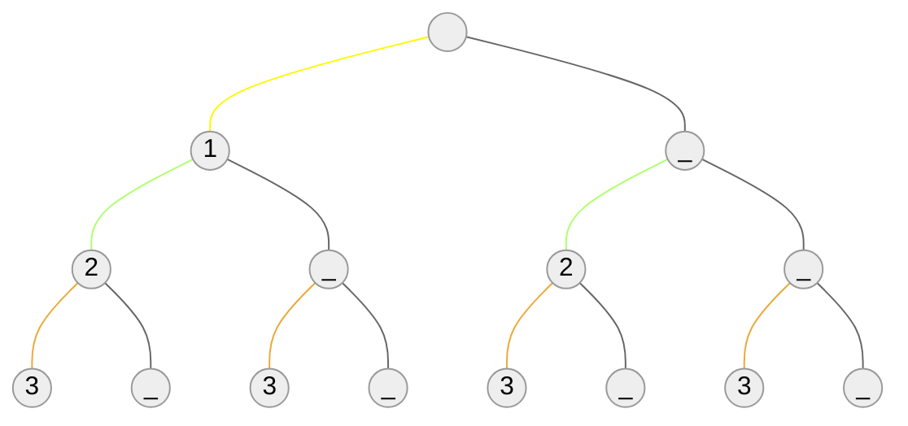
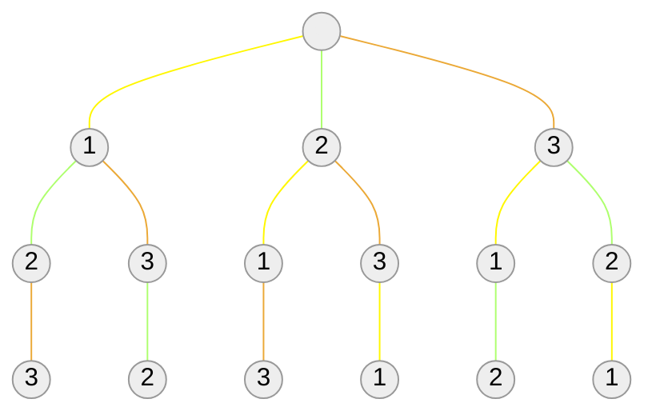
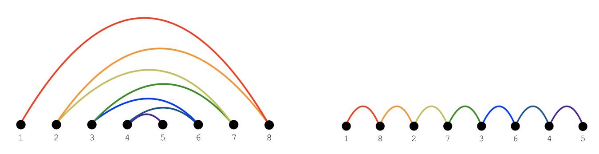
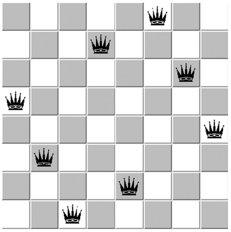
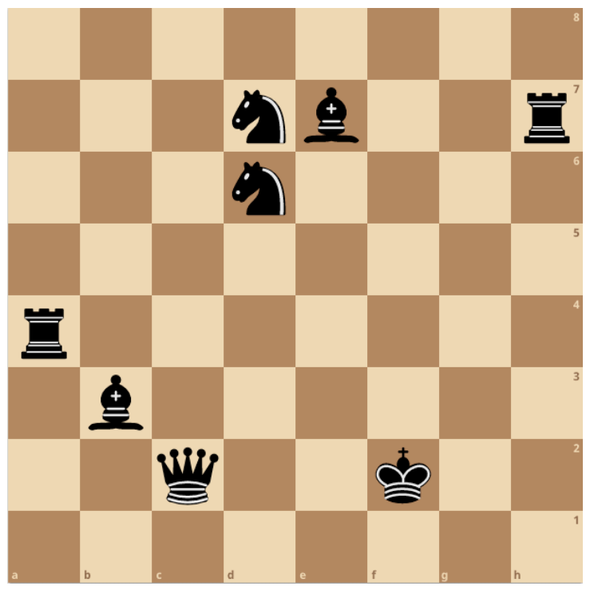
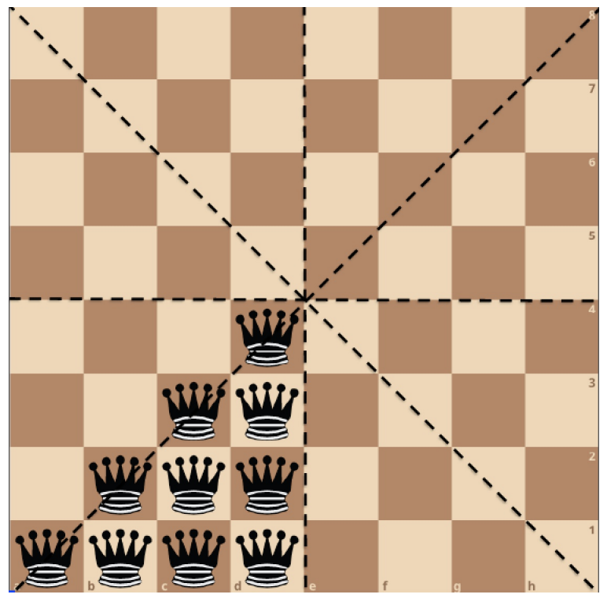

# Backtracking
## Solving Sudoku
- Solving Sudoku puzzles involves a form of exhaustive search of possible configurations.
- However, exploiting constraints to rule out certain possibilities for certain positions enables us to *prune* the search to the point people can solve Sudoku by hand.
- Backtracking is the key to implementing exhausitve search programs correctly and efficiently.
<br></br>

## Backtracking
- Backtracking is a systematic method to iterate through all possible configurations of a search space. It is a general algorithm which must be customized for each application.
- We model our solution as a vector $a = (a_1, a_2, \cdots , a_n)$, where each element $a_i$ is selected from a finite ordered set $S_i$.
- Such a vector might represent an arrangement where $a_i$ contains the $i$ th element of the permutation. Or the vector might represent a given subset $S$, where $a_i$ is true iff the $i$ th element of the universe is in $S$.
<br></br>

## The Idea of Backtracking
- At each step in the backtracking algorithm, we start from a given partial solution, say, $a = (a_1, a_2, \cdots , a_k)$, and try to extend it by adding another element at the end.
- After extending it, we test whether what we have so far is a complete solution.
- If not, the critical issue is whether the current partial solution $a$ is potentially extendible to a solution.
    - If so, recur and continue.
    - If not, delete the last element from $a$ and try another possibility for that position if one exists.
<br></br>

# Backtracking Implementation
## Recursive Backtracking
$\texttt{Backtrack(a, k)}$<br>
$\texttt{if a is a solution, print(a)}$<br>
$\texttt{else}$ { <br>
$\qquad k = k + 1$<br>
$\qquad\texttt{compute } S_k$ <br>
$\qquad\texttt{while } S_k\ne\cancel{0} \texttt{ do}$ <br>
$\qquad\qquad a_k = \texttt{an element in } S_k$<br>
$\qquad\qquad S_k = S_k - a_k$<br>
$\qquad\qquad\texttt{Backtrack(a, k)}$<br>
}
<br></br>

## Backtracking and DFS
Backtracking is really just depth-first search on an implicit graph of configurations.
- Backtracking can easily be used to iterate through all subsets or permutations of a set.
- Backtracking ensures correctness by enumerating all possibilities.
- For backtracking to be efficient, we must prune dead or redundent branches of the search space whenever possible.
<br></br>

## Backtracking Implementation
```c
void backtrack(int a[], int k, data input) {
    int c[MAXCANDIDATES];  /* candidates for next position */
    int nc;                /* next position candidate count */
    int i;                 /* counter */

    if (is_a_solution(a, k, input)) {
        process_solution(a, k, input);
    } else {
        k = k + 1;
        construct_candidates(a, k, input, c, &nc);
        for (i = 0; i < nc; i++) {
            a[k] = c[i];
            make_move(a, k, input);
            backtrack(a, k, input);
            unmake_move(a, k, input);

            if (finished) {
                return;    /* terminate early */
            }
        }
    }
}
```
<br></br>

### $\texttt{is}$ _ $\texttt{a}$ _ $\texttt{solution(a, k, input)}$
- This Boolean function tests whether the first $k$ elements of vector $a$ are a complete solution for the given problem.
- The last argument, $\texttt{input}$, allows us to pass general information into the routine to evaluate whether $a$ is a solution.
<br></br>

### $\texttt{construct}$ _ $\texttt{candidates(a, k, input, c, nc)}$
- This routine fills an array $c$ with the complete set of possible candidates for the $k$ th position of $a$, given the contents of the first $k - 1$ positions.
- The number of candidates returned in this array is denoted by $nc$.
<br></br>

### $\texttt{process}$ _ $\texttt{solution(a, k)}$
- This routine prints, counts, or somehow processes a complete solution once it is constructed.
- Backtracking ensures correctness by enumerating all possibilities. It ensures efficiency by never visiting a state more than once.
- Because a new candidates array $c$ is allocated with each recursive procedure call, the subsets of not-yet-considered extension candidates at each position will not interfere with each other.
<br></br>

# Constructing Subsets by Backtracking
## Constructing all Subsets
- To construct all $2^n$ subsets, set up an array/vector of $n$ cells, where the value of $a_i$ is either true or false, signifying whether the $i$ th item is or is not in the subset.
- To use the notation of the general backtrack algorithm, $S_k = (true, false)$, and $v$ is a solution whenever $k \ge n$.
<br></br>

## Subset Generation Tree / Order
What order will this generate the subsets of ${\{1, 2, 3\}}$?
$${(1)}\to (1, 2)\to \textcolor{red}{(1, 2, 3)} \to \textcolor{red}{(1, 2, -)} \to (1, -) \to \textcolor{red}{(1, -, 3)} \to$$
$$\textcolor{red}{(1, -, -)} \to (1, -) \to (1) \to (-) \to (-, 2) \to \textcolor{red}{(-, 2, 3)} \to$$
$$\textcolor{red}{(-, 2, -)} \to (-, -) \to \textcolor{red}{(-, -, 3)} \to \textcolor{red}{(-, -, -)} \to (-, -) \to (-) \to (-) $$


<br></br>

## Using Backtrack to Construct Subsets
- We can construct all subsets of $n$ items by iterating through all $2^n$ length-$n$ vectors of *true* or *false*, letting the $i$ th element denote whether item $i$ is (or is not) in the subset.
- Thus the candidate set $S_k = (true, false)$ for all positions, and $a$ is a solution when $k \ge n$.
```c
int is_a_solution(int a[], int k, int n) {
    return (k == n);
}

void construct_candidates(int a[], int k, int n, int c[], int *nc) {
    c[0] = true;
    c[1] = false;
    *nc = 2;
}
```
<br></br>

## Process the Subsets
Here we print the elements in each subset, but you can do whatever you want - like test whether it is a vertex cover solution.
```c
void process_solution(int a[], int k, int input) {
    int i;    /* counter */

    printf("{");
    for (i = 1; i <= k; i++) {
        if (a[i] == true) {
            printf(" %d", i);
        }
    }

    printf(" }\n");
}
```
<br></br>

## Main Routine: Subsets
Finally, we must instantiate the call to $\texttt{backtrack}$ with the right arguments.
```c
void generate_subsets(int n) {
    int a[NMAX];    /* solution vector */

    backtrack(a, 0, n);
}
```
<br></br>

# Constructing Permutations by Backtracking
## Constructing all Permutations
- How many permutations are there of an $n$-element set?
- To construct all $n!$ permutations, set up an array/vector of $n$ cells, where the value of $a_i$ is an integer from $1$ to $n$ which has not appeared thus far in the vector, corresponding to the $i$ th element of the permutation.
- To use the notation of the general backtrack algorithm, $S_k = (1, \cdots , n) - v$, and $v$ is a solution whenever $k\ge n$.
<br></br>

## Permutation Generation Tree/Order
$$(1) \to (1, 2) \to \textcolor{red}{(1, 2, 3)} \to (1, 2) \to (1) \to (1, 3) \to$$
$$\textcolor{red}{(1, 3, 2)} \to (1, 3) \to (1) \to () \to (2) \to (2, 1) \to $$
$$\textcolor{red}{(2, 1, 3)} \to (2, 1) \to (2) \to (2, 3) \to \textcolor{red}{(2, 3, 1)} \to (3, 1) \to (3) \to$$
$$(2) \to () \to (3) \to (3, 1) \to \textcolor{red}{(3, 1, 2)} \to (3, 1) \to (3) \to$$
$$(3, 2) \to \textcolor{red}{(3, 2, 1)} \to (3, 2) \to (3) \to () $$


<br></br>

## Constructing All Permutations
To avoid repeating permutation elements, $S_k = \{1, \cdots , n\} - a$, and $a$ is a solution whenever $k = n$:
```c
void construct_candidates(int a[], int k, int n, int c[], int *nc) {
    int i;               /* counter */
    bool in_perm[NMAX];  /* what is now in the permutation? */

    for (i = 1; i < NMAX; i++) {
        in_perm[i] = false;
    }

    for (i = 1; i < k; i++) {
        in_perm[a[i]] = true;
    }

    *nc = 0;
    for (i = 1; i <= n; i++) {
        if (!in_perm[i]) {
            c[*nc] = i;
            *nc = *nc + 1;
        }
    }
}
```
<br></br>

## Auxilliary Routines
- Completing the job of generating permutations requires specifying $\texttt{process}$ _ $\texttt{solution}$ and $\texttt{is}$ _ $\texttt{a}$ _ $\texttt{solution}$, as well as setting the appropriate arguments to $\texttt{backtrack}$.
- All are essentially the same as for subsets:
```c
void process_solution(int a[], int k, int input) {
    int i;  /* counter */

    for (i = 1; i <= k; i++) {
        printf(" %d", a[i]);
    }
    printf("\n");
}

int is_a_solution(int a[], int k, int n) {
    return (k == n);
}
```
<br></br>

## Main Program: Permutations
```c
void generate_permutations(int n) {
    int a[NMAX];    /* solution vector */

    backtrack(a, 0, n);
}
```
<br></br>

# Backtracking Contest
## The Backtracking Contest: Bandwidth
- The *bandwidth problem* takes as input a graph $G$, with $n$ vertices and $m$ edges (ie.pairs of vertices). The goal is to find a permutation of the vertices on the line which minimizes the maximum length of any edge.

<center></center>

- The bandwidth problem has a variety of applications, including circuit layout, linear algebra, and optimizing memory usage in hypertext documents.
<br></br>

### Computing the Bandwidth of a graph
- The bandwidth problem is NP-complete, meaning you will not be able to find an algorithm with polynomial worst-case running time.
- It remains NP-complete even for restricted classes of trees.
- A backtracking program which iterates through all the $n!$ possible permutations and computes the length of the longest edge for each one gives an easy $O(n!\cdot m)$ algorithm.
- But the goal of this assignment is to find as practically good an algorithm as possible, so try to avoid constructing all permutations.
<br></br>

## The Backtracking Contest: Set Cover
- The *set cover* problem takes as input a collection of subsets $S = \{S_1, \cdots , S_m\}$ of the universal set $U = \{1, \cdots , n\}$.
- The goal is to find the smallest subset of the subsets $T$ such that $\cup_{i = 1}^{|T|}{T_i} = U$
<br></br>

### Computing the Minimum Set Cover
- Set cover arises when you try to efficiently acquire or represent items that have been packaged in a fixed set of lots.
- You want to get all the items, buying as few lots as possible.
- Finding *a* cover is easy, because you can always buy one of each lot. But a small set cover will do the same job for less money.
- A backtracking program which iterates through all the $2^m$ possible subsets and tests whether it represents a cover gives an easy $O(2^m\cdot nm)$ algorithm.
- But the goal of this assignment is to find as practically good an algorithm as possible, so try to avoid constructing all subsets.
<br></br>

## Producing Efficient Programs
- Don't optimize prematurely.
    - Don't worry about recursion vs. iteration until you have worked out the best way to prune the tree.
- Choose your data structures for a reason.
    - What operations will you be doing? Is the case of insertion/deletion more crucial than fast retrieval?
- Let the profiler determine where to do final tuning.
    - Your program is probably spending time where you don't expect.
<br></br>

# The Eight-Queen Problem
<center></center>

The eight queens problem is a classical puzzle of positioning eight queens on an $8\times 8$ chessboard such that no two queens threaten each other.
<br></br>

## Eight Queens: Representation
- What is concise, efficient representation for an $n$-queens solution, and how big must it be?
- Since no two queens can occupy the same column, we know that the $n$ columns of a complete solution must form a permutation of $n$. By avoiding repetitive elements, we reduce our search space to just $8! = 40,320$ - clearly short work for any reasonably fast machine.
- The critical routine is the candidate constructor. We repeatedly check whether the $k$ th square on the given row is threatened by any previously positioned queen. If so, we move on, but if not we include it as a possible candidate.
<br></br>

## Candidate Constructor: Eight Queens
```c
void construct_candidates(int a[], int k, int n, int c[], int *ncandidates) {
    int i, j;         /* counters */
    bool legal_move;  /* might the move be legal? */

    *ncandidates = 0;
    for (i = 1; i <= n; i++) {
        legal_move = true;
        for (j = 1; j < k; j++) {
            if (abs((k) - j) == abs(i - a[j])) {  /* diagonal threat */
                legal_move = false;
            }
            if (i == a[j]) {                      /* column threat */
                legal_move = false;
            }
        }
        if (legal_move) {
            c[*ncandidates] = i;
            *ncandidates = *ncandidates + 1;
        }
    }
}
```
<br></br>

## Auxiliary Routines
The remaining routines are simple, particularly since we are only interested in counting the solutions, not displaying them:
```c
void process_solution(int a[], int k, int input) {
    solution_count++;
}

int is_a_solution(int a[], int k, int n) {
    return (k == n);
}
```
<br></br>

## Finding the Queens: Main Program
```c
void nqueens(int n) {
    int a[NMAX];  /* solution vector */

    solution_count = 0;
    backtrack(a, 0, n);
    printf("n = %d solution_count = %d\n", n, solution_count);
}
```
This program can find the $365,596$ solutions for $n = 14$ in minutes.
<br></br>

# Covering the Chess Board
## Can Eight Pieces Cover a Chess Board?
Consider the 8 main pieces in chess (king, queen, two rooks, two bishops, two knights). Can they be positioned on a chessboard so every square is threatened?

<center></center>
<br></br>

## Combinatorial Search
- Only 63 square are threatened in this configuration. Since 1849, no one had been able to find an arrangement with bishops on different colors to cover all squares.
- We can resolve this question by searching through all possible board configurations *if* we spend enough time.
- We will use it as an example of how to attack a combinatorial search problem.
- With clever use of backtracking and pruning techniques, surprisingly large problems can be solved by exhaustive search.
<br></br>

## How Many Chess Configurations Must be Tested?
Picking a square for each piece gives us the bound:
$$64!/(64 - 8)! = 178,462,987,637,760\approx 10^{15}$$
Anything much larger than $10^8$ is unreasonable to search on a modest computer in a modest amount of time.
<br></br>

## Exploiting Symmetry
- However, we can exploit symmetry to save work. With reflections along horizontal, vertical, and diagonal axis, the queen can go in only 10 non-equivallent positions.
- Even better, we can restrict the white bishop to 16 spots and the queen to 16, while seeing all distinct configurations.

<center></center>

$$16\times 16\times 32\times 64\times 2080\times 2080 = 2,268,279,603,200\approx 10^{12}$$
<br></br>

## Covering the Chess Board
- In covering the chess board, we prune whenever we find there is a square which we *cannot* cover given the initial configuration!
- Specifically, each piece can threaten a certain maximum number of squares (queen 27, king 8, rook 14, etc.) We *prune* whenever the number of unthreated squares exceeds the sum of the maximum remaining coverage.
- As implemented by a graduate student project, this backtrack search eliminates 95% of the search space, when the pieces are ordered by decreasing mobility.
- With precomputing the list of possible moves, this program could search 1,000 positions per second.
<br></br>

## End Game
- But this is still too low!
$$10^{12}/10^3 = 10^9 seconds > 1000 days$$
- Although we might further speed the program by an order of magnitude, we need to prune more nodes!
- By using a more clever algorithm, we eventually were able to prove no solution existed, in less than one day's worth of computing.