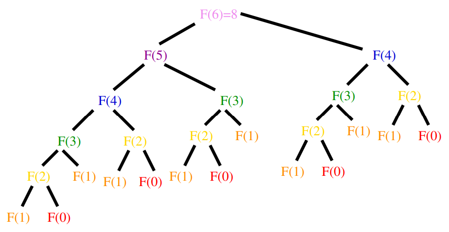

# Introduction to Dynamic Programming
## Dynamic Programming
- Dynamic programming is a very powerful, general tool for solving optimization problems on left-right-ordered items such as character strings.
- Once understood it is relatively easy to apply, it looks like magic until you have seen enough examples.
- Floyd's all-pairs shortest-path algorithm was an example of dynamic programming.
<br></br>

## Greedy vs. Exhaustive Search
- *Greedy* algorithms focus on making the best local choice at each decision point. In the absence of a correctness proof such greedy algorithms are very likely to fail.
- Dynamic programming gives us a way to design custom algorithms which systematically search all possibilities (thus guaranteeing correctness) while storing results to avoid recomputing (thus providing efficiency).
<br></br>

## Recurrence Relations
- A recurrence relation is an equation which is defined in terms of itself. They are useful because many natural functions are easily expressed as recurrences:<br>
$\texttt{Polynomials: } a_n = a_{n - 1} + 1, a_1 = 1 \to a_n = n$
$\texttt{Exponentials: } a_n = 2a_{n - 1}, a_1 = 2 \to a_n = 2^n$
$\texttt{Weird: } a_n = na_{n - 1}, a_1 = 1 \to a_n = n!$
- Computer programs can easily evaluate the value of a given recurrence even without the existence of a nice closed form.
<br></br>

# Fibonacci Numbers
## Computing Fibonacci Numbers
$$F_n = F_{n - 1} + F_{n - 2}, F_0 = 0, F_1 = 1$$
Implementing this as a recursive procedure is easy, but slow because we keep calculating the same value over and over.
```c
long fib_r(int n) {
    if (n == 0) {
        return (0);
    }

    if (n == 1) {
        return (1);
    }

    return (fib_r(n - 1) + fib_r(n - 2));
}
```
<br></br>

## How Slow?
$$F_{n + 1}/F_n \approx \phi = (1 + \sqrt{5}) / 2 \approx 1.61803$$

<center></center>

Thus $F_n \approx 1.6^n$. Since our recursion tree has $0$ and $1$ as leaves, computing $F_n$ requires $\approx 1.6^n$ calls.
<br></br>

## What about Memoization?
We can explicitly cache calls after computing results to avoid recomputation:
```c
#define MAXN    92  /* largest n for which F(n) fits in a long */
#define UNKNOWN -1  /* contents denote an empty cell */
long f[MAXN + 1]    /* array for caching fib values */

long fib_c(int) {
    if (f[n] == UNKNOWN) {
        f[n] = fib_c(n - 1) + fib_c(n - 2);
    }

    return (f[n]);
}

long fib_c_driver(int n) {
    int i;    /* counter */

    f[0] = 0;
    f[1] = 1;

    for (i = 2; i <= n; i++) {
        f[i] = UNKNOWN;
    }

    return (fib_c(n));
}
```
<br></br>

## What about Dynamic  Programming?
- We can calculate $F_n$ in linear time by storing small values:<br>
$F_0 = 0$<br>
$F_1 = 1$<br>
$\texttt{For } i = 1 \texttt{ to } n$<br>
$\qquad F_i = F_{i - 1} + F_{i - 2}$
- We traded space for time.
<br></br>

## Fibonacci by Dynamic Programming
```c
long fib_dp(int n) {
    int i;             /* counter */
    long f[MAXN + 1];  /* array for caching values */

    f[0] = 0;
    f[1] = 1;

    for (i = 2; i <= n; i++) {
        f[i] = f[i - 1] + f[i - 2];
    }

    return (f[n]);
}
```
<br></br>

# Binomial Coefficients
## Avoiding Recomputation by sorting Results
- The trick to dynamic programming is to see that the naive recursive algorithm repeatedly computes the same subproblems over again, so storing the answers in a table instead of recomputing leads to an efficient algorithm.
- We first hunt for a correct recursive algorithm, then we try to speed it up by using a results matrix.
<br></br>

## Binomial Coefficients
The most important class of counting numbers are the *binomial coefficients*, where $n \choose k$ counts the number of ways to choose $k$ things out of $n$ possibilities.
- *Committees* - How many ways are there to form a $k$-member committee from $n$ people? By definition, $n \choose k$.
- *Paths Across a Grid* - How many ways are there to travel from the upper-left corner of an $n \times m$ grid to the lower-right corner by walking only down and to the right? Every path must consist of $n + m$ steps, $n$ downward and $m$ to the right, so there are ${n + m} \choose n$ such sets/paths.
<br></br>

## Computing Binomial Coefficients
- Since $n\choose k$ $= n! / ((n - k)!k!)$, in principle you can compute them straight from factorials.
- However, intermediate calculations can *easily* cause arithmetic overflow even when the final coefficient fits comfortably within an integer.
<br></br>

## Pascal's Triangle
Each number is the sum of the two numbers directly above it:

<center></center>
<br></br>

## Pascal's Recurrence
- A more stable way to compute binomial coefficients is using the recurrence relation implicit in the construction of Pascal's triangle, namely, that<br></br>
$n\choose k$ $=$ ${n - 1} \choose {k - 1}$ $ + $ ${n - 1} \choose k$
- It works because the $n$ th element either appears or does not appear in one of the $n \choose k$ subsets of $k$ elements.
<br></br>

## Basis Case
- No recurrence is complete without basis cases.
- How many ways are there to choose 0 things from a set?
- Exactly one, the empty set.
- The right term of the sum drives us up to $k \choose k$. How many ways are there to choose $k$ things from a $k$-element set? Exactly one, the complete set.
<br></br>

## Binomial Coefficients Implementation
```c
long binomial_coefficient(int n, int k) {
    int i, j;                     /* counters */
    long bc[MAXN + 1][MAXN + 1];  /* binomial coefficient table */

    for (i = 0; i <= n; i++) {
        bc[i][0] = 1;
    }

    for (j = 0; j <= n; j++) {
        bc[j][j] = 1;
    }

    for (i = 2; i <= n; i++) {
        for (j = 1; j < i; j++) {
            bc[i][j] = bc[i - 1][j - 1] + bc[i - 1][j];
        }
    }

    return (bc[n][k]);
}
```