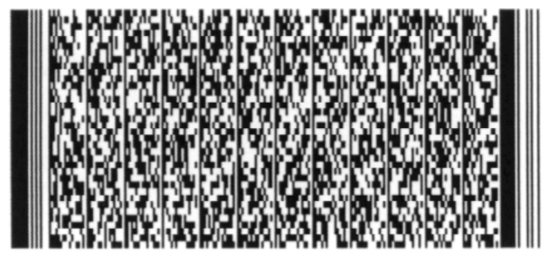
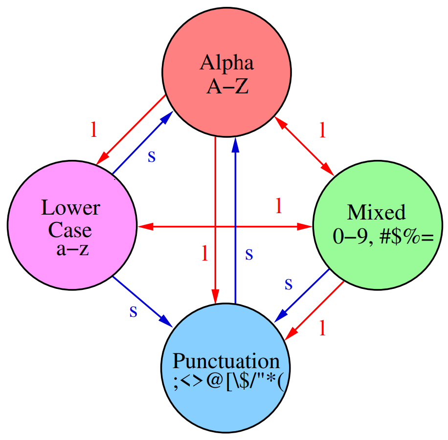

# Dynamic Programming and High-Density Bar Codes
- Symbol Technology has developed a new design for bar codes, PDF-417 that has a capacity of several hundred bytes.
- What is the best way to encode text for this design?
- They developed a complicated mode-switching data compression scheme.

  

## The PDF-417 Code
- Latch commands permanently put you in a different mode.
- Shift commands temporarily put you in a different mode.

  

## Optimization
- Symbol used a greedy algorithm to encode a string, making local decisions only. But we realized that for any prefix, you want an optimal encoding which might leave you in every possible mode.
- $M[i, j] = \min (M[i - 1, k] +$ the cost of encoding the $i$ th character and ending up in node $j$.
- Our simple dynamic programming algorithm imporved the capacity of PDF-417 by an average of 8%.
  

# The Book Partition Problem
## Dividing the Work
- Suppose the job scanning through a shelf of books is to be split between $k$ workers. To avoid the need to rearrange the books or separate them into piles, we can divide the shelf into $k$ regions and assign each region to one worker.
- What is the fairest way to divide the shelf up?
- If each book is the same length, partition the books into equal-sized regions.
$$\texttt{100 100 100 | 100 100 100 | 100 100 100}$$
- But what if the books are not the same length? This partition would yield
$$\texttt{100 200 300 | 400 500 600 | 700 800 900}$$
  

## The Linear Partition Problem
Input: A given arrangement $S$ of nonnegative numbers $\{s_1, \cdots , s_n\}$ and an integer $k$. 
Problem: Partition $S$ into $k$ ranges, so as to minimize the maximum sum over all the ranges.
- Does a single fixed partition work for all instances of size $(n, k)$?
- Does taking the average value of each part $(\sum^{n}_{i = 1}{s_i / k})$ from the left always yield the optimal partition?
  

## Recursive Idea
- Consider a recursive, exhaustive search approach. Notice that the $k$ th partition starts right after we placed the $(k - 1)$ st divider.
- Where can we place this last divider? Between the $i$ th and $(i + 1)$ st elements for some $i$, where $1 \le i \le n$.
- What is the cost of this? The total cost will be the larger of two quantities, (1) the cost of the last partition $\sum^{n}_{j = i + 1}{s_j}$ and (2) the cost of the largest partition cost formed to the left of $i$.
- What is the size of this left partition? To partition the elements $\{s_1, \cdots , s_i\}$ as equally as possible.
  

## Dynamic Programming Recurrence
- Define $M[n, k]$ to be the minimum possible cost over all partitionings of $\{s_1, \cdots , s_n\}$ into $k$ ranges, where the cost of a partition is the largest sum of elements in one of its parts.
- Thus defined, this function can be evaluated:
$$M[n, k] = \min_{i = 1}^{n}\max{(M[i, k - 1], \sum_{j = i + 1}^{n}{s_j})}$$
$\qquad$ with the natural basis cases of
$$M[1, k] = s_1, \texttt{for all } K > 0 \texttt{ and},$$
$$M[n, 1] = \sum_{i = 1}^{n}{s_i}$$
  

## Running Time
- What is the running time?
- It is the number of cells times the running time per cell.
- A total of $k\cdot n$ cells exist in the table.
- Each cell depends on $n$ others, and can be computed in linear time, for a total of $O(kn^2)$.
  

# Limitations of Dynamic Programming
## What can you use Dynamic Programming?
Dynamic programming computes recurrences efficiently by storing partial results. Thus dynamic programming is efficient when there are few partial results to compute.
- There are $n!$ permutations of an $n$ -element set, so we cannot hope to to store the best solution for each subpermutation *polynomially*.
- There are $2^n$ subsets of an $n$ -element set, so we cannot hope to store the best solution for each *polynomially*.
- But there are *only* $n(n - 1) / 2$ continguous substrings of a string, so we can use it for string problems.

Dynamic programming works best on objects which are linearly ordered and cannot be rearranged - characters in a string, matrices in a chain, points around the boundary of a polygon, the left-to-right order of leaves in a search tree.
  

## The Principle of Optimality
To use dynamic programming, the problem must observe the *principle of optimality*, that whatever the initial state is, remaining decisions must be optimal with regard the state following from the first decision.
- Dijkstra's algorithm works because we care about the length of the shortest path to $x$, not how we get there.
- Edit distance works because we care about the cheapest way edit given prefixes, not how we got here.

This would not be true if we charged more for a deletion if there were other deletions nearby.
  

## The Traveling Salesman Problem
- Combinatorial problems may observe this property but still use too much memory/time to be efficient.
- Let $T(i; j_1, j_2, \cdots , j_k)$ be the cost of the optimal tour from $1$ to $i$ that goes through each of the other cities once
$$T(i; i_1, j_2, \cdots , j_i) = Min_{1\le m\le k}{C[i, j_m]} + T(j_m; j_1, j_2, \cdots , j_k)$$
$$T(i, j) = C(i, j) + C(j, 1)$$
- Here there can be any subset of $j_1, j_2, \cdots , j_k$ instead of any subinterval - hence exponential.
- But it is $O(n2^n)$ instead of $n!$.