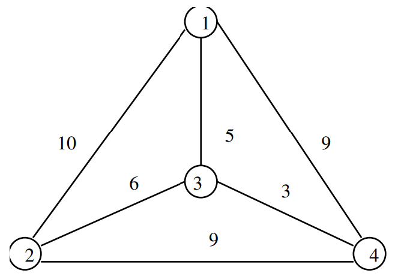

# Problems and Reductions
## What is a Problem?
A *problem* is a general question, with parameters for the input and conditions on what is a satisfactory answer or solution.
- Exapmle: The Traveling Salesman
- Problem: Given a weighted graph $G$, what tour $\{v_1, v_2, \cdots , v_n\}$ minimizes $\sum_{i = 1}^{n -1}{d[v_i, v_{i + 1}] + d[v_n, v_1]}$.
  

## What is an Instance?
An instance is a problem with the input parameters specified.

TSP instance: $d[v_1, d_2] = 10,\ \ d[v_1, d_3] = 5, \ \, d[v_1, d_4] = 9, \ \ d[v_2, d_3] = 6, \ \ d[v_2, d_4]= 9, \ \ d[v_3, d_4] = 3$

Solution: $\{v_1, v_2, v_3, v_4\} \texttt{ cost} = 27$
  

## Decision Problems
- A problem with answers restricted to *yes* and *no* is called a *decision problem*.
- Most interesting optimization problems can be phrased as decision problems which capture the essence of the computation.
  

## The Traveling Salesman Decision Problem
- Given a weighted graph $G$ and integer $k$, does there exist a traveling salesman tour with cost $\le k$ ?
- Using binary search and the decision version of the problem we can find the optimal TSP solution.
  

## Reductions
Reducing(transforming) one algorithm problem $A$ to another problem $B$ is an argument that if you can figure out how to solve $B$ then you can solve $A$.