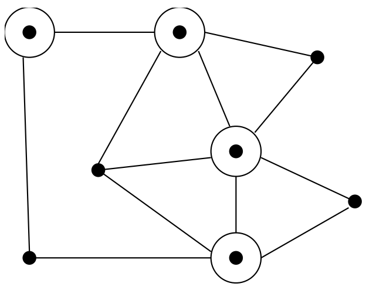
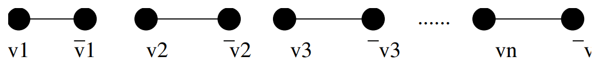
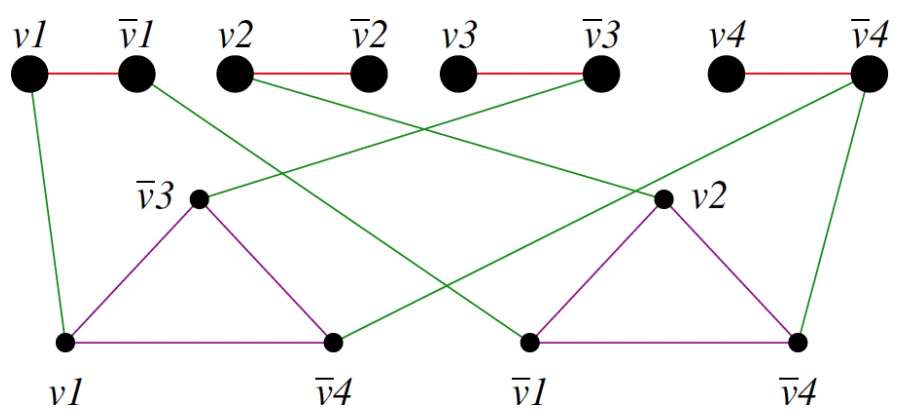
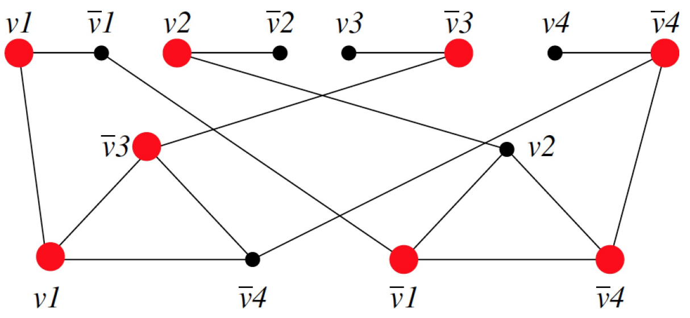
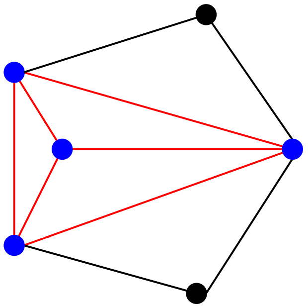
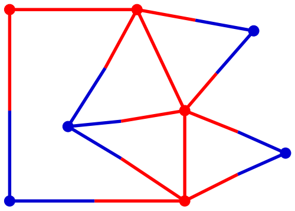
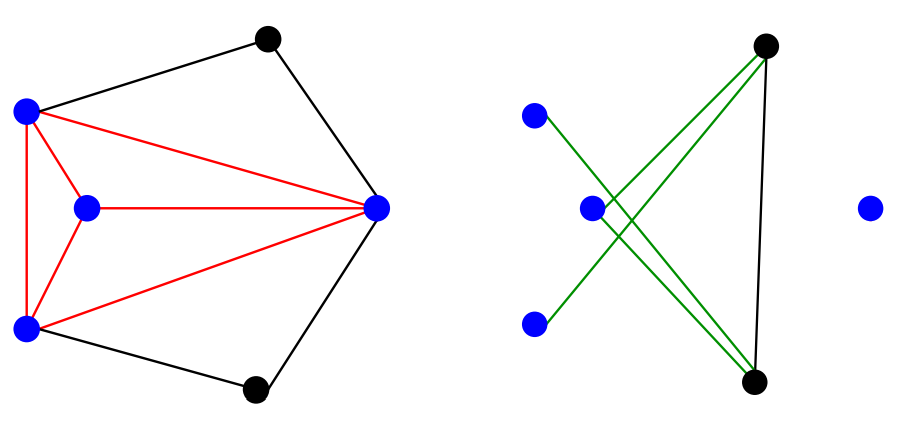

# Satisfiability
Consider the following logic problem:
- Instance: A set $V$ of variables and a set of clauses $C$ over $V$.
- Question: Does there exist a satisfying truth assignment for $C$?
- Example 1: $V = v_1, v_2$ and $C = \{\{v_1, \bar{v_2}\}, \{\bar{v_1}, v_2\}\}$

A clause is satisfied when at least one literal in it is true. $C$ is satisfied when $v_1=v_2=$ true.
  

## Not Satisfiable
Example 2: $V = v_1, v_2, \ \ C=\{\{v_1, v_2\}, \{v_1, \bar{v_2}\}, \{\bar{v_1}\}\}$

- Although you try and try, you can get no satisfaction.
- There is no satisfying assignment since $v_1$ must be false (third clause), so $v_2$ must be false (second clause), but then the first clause is unsatisfiable!
  

## Satisfiability is Hard
- Satisfiability is known/assumed to be a hard problem.
- Every top-notch algorithm expert in the world has tried and failed to come up with a fast algorithm to test whether a given set of clauses is satisfiable.
- Further, many strange and impossible-to-believe things have been shown to be true if someone in fact did find a fast satisfiability algorithm.
  

# 3-Satisfiability
- Instance: A collection of clause $C$ where each clause contains *exactly* 3 literals, boolean variable $v$.
- Question: Is there a truth assignment to $v$ so that each clause is satisfied?
  

## 3-SAT is NP-Complete
To prove it is complete, we give a reduction from $Sat\propto 3-Sat$. We will transform each clause independantly based on its *length*.  
Suppose the clause $C_i$ contains $k$ literals.
- If $k = 1$, meaning $C_i = \{z_1\}$, create two new variables $v_1, \ \ v_2$ and four new 3-literal clauses:
$$\{v_1, v_2, z_1\}, \{v_1, \bar{v_2}, z_1\}, \{\bar{v_1}, v_2, z_1\}, \{\bar{v_1}, \bar{v_2}, z_1\}$$
$\qquad$ Note that the only way all four of these can be satisfied is if $z$ is true. 
- If $k = 2$, meaning $\{z_1, z_2\}$, create one new variable $v_1$ and two new clauses: $\{v_1, z_1, z_2\}, \{\bar{v_1}, z_1, z_2\}$
- If $k = 3$, meaning $\{z_1, z_2, z_3\}$, copy into the 3-SAT instance as it is.
- If $k > 3$, meaning $\{z_1, z_2, \cdots , z_n\}$, create $n - 3$ new variables and $n - 2$ new clauses in a chain: $\{v_i, z_i, \bar{v_i}\}, \cdots$
  

## Why does the Chain Work?
- If none of the original variables in a clause are true, there is no way to satisfy all of them using the additional variable:
$$(F, F, T), (F, F, T), \cdots , (F, F, F)$$
- But if any literal is true, we have $n - 3$ free variables and $n - 3$ remaining 3-clauses, so we can satisfy all clauses.
- $(F, F, T), (F, F, T), \cdots , (F, T, F), \cdots , (T, F, F), (T, F, F)$
- Any SAT solution will also satisfy the 3-SAT instance and any 3-SAT solution sets variables giving a SAT solution, so the problems are equivalent.\
  

## 4-Sat and 2-Sat
- A slight modification to this construction would prove 4-SAT, or 5-SAT,... also NP-complete.
- However, it breaks down when we try to use it for 2-SAT, since there is no way to stuff anything into the chain of clauses.
  

# Vertex Cover
## The Power of 3-SAT
- Now that we have shown 3-SAT is NP-complete, we may use it for further reductions. Since the set of 3-SAT instances is smaller and more regular than the SAT instances, it will be easier to use 3-SAT for future reductions.
- Remember the direction of the reduction.
$$Sat\propto 3 - Sat \propto X$$ 
  

## A Perpetual Point of Confusion
- Note carefully the direction of the reduction.
- We must transform *every* instance of a known NP-complete problem to an instance of the problem we are interested in.
- If we do the reduction the other way, all we get is a slow way to solve $x$, by using a subroutine which probably will take exponential time.
  

## Vertex Cover
- Instance: A graph $G = (V, E)$, and integer $k \le V$
- Question: Is there a subset of at most $k$ vertices such that every $e\in E$ has at least one vertex in the subset?

- Here, four of the eight vertices suffice to cover.
- It is easy to find *a* vertex cover of a graph: just take all the vertices. The hard part is to cover with as small a set as possible.
  

## Vertex Cover is NP-complete
- To prove completeness, we show reduce 3-SAT to VC. From a 3-SAT instance with $n$ variables and $c$ clauses, we construct a graph with $2n + 3c$ vertices.
- For each variable, we create two vertices connected by an edge:

- To cover each of these edges, at least $n$ vertices must be in the cover, one for each pair.
  

## Clause Gadgets
- For each clause, we create three new vertices, one for each literal in each clause. Connect these in a triangle.
- At least two vertices per triangle must be in the cover to take care of edges in the triangle, for a total of at least $2c$ vertices.
- Finally, we will connect each literal in the flat structure to the corresponding vertices in the triangles which share the same literal.

  

## Claim: $G$ has a VC of size $n + 2c$ iff $S$ is Satisfiable
- Any cover of $G$ must have at least $n + 2c$ vertices. To show that our reduction is correct, we must show that:
- Every satisfying truth assignment gives a cover.
- Select the $n$ vertices corresponding to the true literals to be in the cover.
- Since it is a satisfying truth assignment, at least one of the three cross edges associated with each clause must already be covered - pick the other two vertices to complete the cover.
  

## Every vertex cover gives a satisfying truth assignment
- Every vertex cover must contain $n$ first stage vertices and $2c$ second stage vertices. Let the first stage vertices define the truth assignment.
- To give the cover, at least one cross-edge must be covered, so the truth assignment satisfies.
  

## Example Reduction
- Every SAT defines a vertex cover, and every cover truth values for the SAT.
- Example: $V_1 = V_2 = true, V_3 = V_4 = false$

  

# Clique and Independent Set
## Starting from the Right Problem
- As you can see, the reductions can be very clever and very complicated. While theoretically any NP-complete problem can be reduced to any other one, choosing the correct one makes finding a reduction much easier.
$$3-Sat\propto VC$$
  

## Maximum Independent Set
- Instance: A graph $G = (V, E)$ and integer $j\le v$.
- Question: Does the graph contain an independent of $j$ vertices, ie. is there a subset of $v$ of size $j$ such that no pair of vertices in the subset defines an edge of $G$?

- Example: this graph contains an independent set of size 2. Recall that the movie star scheduling problem was a version of maximum independent set.
  

## Proving Graph Problems Hard
- When talking about graph problems, it is most natural to work from a graph problem - the only NP-complete one we have is vertex cover.
- If you take a graph and find its vertex cover, the remaining vertices form an independent set, meaning there are no edges between any two vertices in the independent set.
- Why? If there were such an edge the rest of the vertices could not have been a vertex cover.
  

## Maximum Independent Set is NP-Complete

- The smallest vertex cover gives the biggest independent set, and so the problems are equivalent: delete the subset of vertices in one from $V$ to get the order.
- Thus finding the maximum independent set is NP-complete.
  

## Maximum Clique
- Instance: A graph $G = (V, E)$ and integer $j\le v$.
- Question: Does the graph contain a clique of $j$ vertices, ie. is there a subset of $v$ of size $j$ such that every pair of vertices in the subset defines an edge of $G$?

- Example: this graph contains a clique of size 5.
  

## From Independent Set
- In an independent set, there are no edges between two vertices.
- In a clique, there are always between two vertices.
- Thus if we complement a graph (have an edge iff there was no edge in the original graph), a clique becomes an independent set and an independent set becomes a clique.

  

## Punch Line
Thus finding the largest clique is NP-complete:
- If $VC$ is a vertex cover in $G$, then $V - VC$ is a clique in $\bar{G}$.
- If $C$ is a clique in $G$, $V - C$ is a vertex cover in $\bar{G}$.