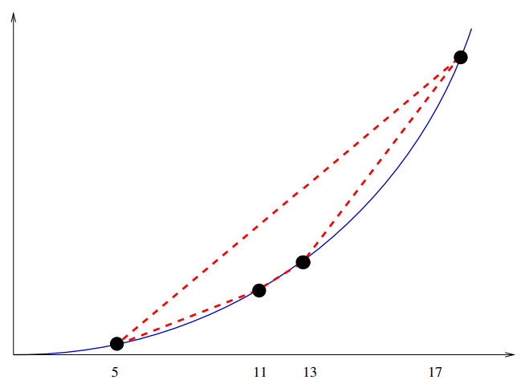

# Integer Partition
## Integer Partition(Subset Sum)
- Instance: A set of integers $S$ and a target integer $t$.
- Problem: Is there a subset of $S$ which adds up exactly to $t$?
- Example: $S = \{1, 4, 16, 64, 256, 1040, 1041, 1093, 1284, 1344\}$ and $T = 3754$
- Answer: $1+ 16 + 64 + 256 + 1040 + 1093 + 1284 = T$

Observe that integer partition is a number problem, as opposed to the graph and logic problems we have seen to date.
  

## Integer Partition is NP-complete
- To prove completeness, we show that vertex cover $\propto$ integer partition. We use a data structure called an incidence matrix to represent the graph $G$.

- How many 1's are there in each column? Exactly two.
- How many 1's in a row? Depends on the vertex degree.
  

## Using the Incidence Matrix
The reduction from vertex cover creates $n + m$ numbers from $G$.
- Each "vertex" number will be a base-4 realization of the incidence matrix row, plus a high order digit:
$$x_i = 4^{|E|} + \sum_{j = 0}^{|E| - 1}{b[i, j] \times 4^j} $$
$\quad \ \ $ so $V_2 = 10100$ becomes $4^5 + (4^4 + 4^2)$.
- Each column/edge will also get a number: $y_i = 4^i$.
- The target integer will be
$$t = k\times 4^{|E|} + \sum_{j = 0}^{|E| - 1}{2\times 4^j}$$

## How?
- Each column (digit) represents an edge. We want a subset of vertices which covers each edge.
- We can only use $k\times \texttt{vertex/numbers}$, because of the high order digit of the target, here $T = 222222 = 2730$

## Why?
- Because there are at exactly three 1s per column, no sum of them can carry over to the next column (in base-4).
- In any vertex cover, edge $e_i$ can be covered either once or twice, but with the option of adding number $y_i$ we can always cover it twice without adding vertex numbers.
  

## $VC$ in $G\to$ Integer Partition in $S$
- Given $k$ vertices covering $G$, pick the $k$ corresponding vertex/numbers.
- Each edge in $G$ is incident on one or two cover vertices.
- If it is one, includes the corresponding edge/number to give two per column.
  

## Integer Partition in $S\to VC$ in $G$
- Any solution to $S$ must contain *exactly* $k$ vertex/numbers. The target in that digit is $k$, so not more, and because there are no carries not less.
- The subset of $k$ vertex/numbers must contain at least one edge $e_i$ per column $i$. We can always pick up the second 1 to match the target using $y_i$.
  

# Integer Programming
- Instance: A set $v$ of integer variables, a set of inequalities over these variables, a function $f(v)$ to maximize, and integer $B$.
- Question: Does there exist an assignment of integers to $v$ such that all inequalities are true and $f(v) \ge B$?
- Example:
$$v_1 \ge 1, v_2 \ge 0$$
$$v_1 + v_2 \le 3$$
$$f(v): 2v_2, B = 3$$
$\quad \ \ $ A solution to his is $v_1 = 1, v_2 = 2$.
  

## Infeasible Example
Example:
$$v_1 \ge 1, \ \ v_2 \ge 0$$
$$v_1 + v_2 \le 3$$
$$f(v): 2v_2, \ \ B = 5$$
Since the maximum value of $f(v)$ given the constraints is $2\times 2 = 4$, there is no solution.
  

## Integer Programming is NP-Hard
- We use a reduction from Satisfiability.
- Any SAT instance has boolean variables and clauses. Our Integer programming problem will have twice as many variables as the SAT instance, one for each variable and its compliment, as well as the following inequalities:
- For each variable $v_i$ in the set problem, we will add the following constraints:
    - $1\le V_i \le 0$ and $1\le \bar{V_i} \le 0$ $\newline$ Both IP variables are restricted to values of 0 or 1, which makes them equivalent to boolean variables restricted to true/false.
    - $1\le V_i + \bar{V_i} \le 1$ $\newline$ Exactly one IP variable associated with a given SAT variable is 1. Thus exactly one of $V_i$ and $\bar{V_i}$ are true.
    - For each clause $C_i = \{v_1, \bar{v_2}, \bar{v_3}\cdots v_n\}$ in the SAT instance, contruct a constraint:
$$v_1 + \bar{v_2} + \bar{v_3} + \cdots v_n \ge 1$$
$\qquad\quad$ Thus at least one IP variable $ = 1$ in each clause. 
$\qquad\quad$ Satisfying the constraint equals satisfying the clause.

Our maximixation function and bound are relatively unimportant: $f(v) = V_1 B = 0$. 
Clearly this reduction can be done in polynomial time.
  

## Why?
- Any SAT solution gives a solution to the IP problem - A TRUE literal in SAT corresponds to a 1 in the IP. If the expression is satisfied, at least one literal per clause must be TRUE, so the sum in the inequality is $\ge 1$.
- Any IP solution gives a SAT solution - All variables of any IP solution are 0 or 1. Set the literals corresponding to 1 to be TRUE and those of 0 to FALSE. No boolean variable and its complement will both be true, so it is a legal assignment which satisfies the clauses.
  

## Things to Notice
- The reduction preserved the structure of the problem. Note that the reduction did not *solve* the problem - it just put it in a different format.
- The possible IP instances which result are a small subset of the possible IP instances, but since some of them are hard, the problem in general must be hard.
- The transformation captures the essence of why IP is hard - it has nothing to do with big coefficients or big ranges on variables: for restricting to 0/1 is enough.
  

# Convex Hull
## Convex Hull and Sorting
- A nice example of a reduction goes from sorting numbers to the convex hull problem:

- We must translate each number to a point. We can map $x$ to $(x, x^2)$.
  

## Why the Parabola?

- Each integer is mapped to a point on the parabola $y = x^2$.
- Since this parabola is convex, every point is on the convex hull. Further since neighboring points on the convex hull have neighboring $x$ values, the convex hull returns the points sorted by $x$-coordinate, ie. the original numbers.
  

## Convex Hull to Sorting Reduction
$\texttt{Sort(}S\texttt{)}$ 
$\qquad\texttt{For each } i\in S, \texttt{ create point } (i, i^2)$ 
$\qquad\texttt{Call subroutine convex-hull on this point set.}$ 
$\qquad\texttt{From the leftmost point in the hull, }$ 
$\qquad\qquad\texttt{read off the points from left to right.}$
- Recall the soring lower bound of $\Omega(n\lg{n})$. If we could do convex hull in better than $n\lg{n}$, we could sort faster than $\Omega (n\lg{n})$ - which violates our lower bound.
- Thus convex hull must take $\Omega (n\lg{n})$ as well.
- Observe that any $O(n\lg{n})$ convex hull algorithm also gives us a complicated but correct $O(n\lg{n})$ sorting algorithm as well.