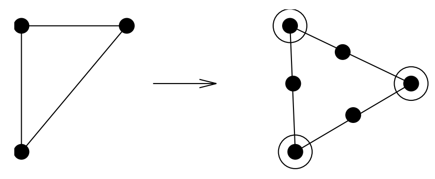

# The Art of Proving Hardness
## Techniques for Proving NP-completeness
- *Restriction* - Show that a special case of your problem is NP-complete. E.g. the problem of finding a path of length $k$ is really Hamiltonian Path.
- *Local Replacement* - Make local changes to the structure. An example is the reduction $SAT\propto 3-SAT$. Another is showing isomorphism is no easier for bipartite graphs.

$\quad$ For any graph, replacing an edge with makes it bipartite.
  

## The Art of Proving Hardness
- Proving that problems are hard is an skill. Once you get the hang of it, it is surprisingly straightforward and pleasurable to do.
- The dirty little secret of NP-completeness proofs is that they are usually easier to recreate than explain, in the same way that it is usually easier to rewrite old code than the try to understand it.
  

## Make your source problem as simple (i.e. restricted) as possible
Never use TSP as a source problem:
- Better is *TSP on instances restricted to the triangle inequality*.
- Even better, use *Hamiltonian cycle*, where all the weights are 1 or $\infty$.
- Even better, use *Hamiltonian path* instead of cycle.
- Even better, use *Hamiltonian path on directed, planar graphs where each vertex has total degree 3*.
  

## Make your target problem as hard as possible
Don't be afraid to add extra constraints or weights or freedoms to problem in order to make your problem more general(at least temporarily).
  

## Select the right source problem for the right reason
Selecting the right source problem makes a big difference is how difficult it is to prove a problem hard. This is the first and easiest place to go wrong.
- 3-Sat: when none of the three problems below seem appropriate, go back to the source.
- Integer partition: the one and only choice for problems whose hardness seems to require using large numbers.
- Vertex cover: for any graph problems whose hardness depends upon *selection*. Chromatic number, clique, and indedpendent set all involve trying to select the correct subset of vertices or edges.
- Hamiltonian path: for any graph problems whose hardness depends upon *ordering*, like when you are trying to route or schedule something.
  

## Amplify the penalties for making the undesired transition
- You are trying to translate one problem into another, while making them stay the same as much as possible.
- Be bold with your penalties, to punish anyone trying to deviate from your proposed solution.
- "If you pick this, then you have to pick up this huge set which dooms you to lose."
- The sharper the consequences for doing what is undesired, the easier it is to prove if and only if.
  

## Think strategically at a high level, then build gadgets to enforce tactics
You should be asking these kinds of questions:
- How can I force that either A or B but not both are chosen?
- How can I force that A is taken before B?
- How can I clean up the things I did not select?
  

## Alternate between looking for an algorithm or a reduction if you get stuck
- Sometime the reason you cannot prove hardness is that there is an efficient algorithm to solve your problem.
- When you can't prove hardness, it likely pays to change your thinking at least for a little while to keep you honest.
  

# P vs. NP
- A problem is in NP if a given answer can be checked in polynomial time.
- A problem is in P if it can be solve in time polynomial in the size of the input.

Satisfiability is in NP, since we can guess an assignment of (true, false) to the literals and check it in polynomial time. 
The precise distinction between P or NP is somewhat technical, requiring formal language theory and Turing machines to state correctly. 
But the real issue is the difference between finding solutions or verifying them.
  

## Classifying Example Problems
- In P: Is there a path from $s$ to $t$ in $G$ of length less than $k$.
- In NP: Is there a TSP tour in $G$ of length less than $k$. Given the tour, it is easy to add up the costs and convince me it is correct.
- *Not* in NP: How many TSP tours are there in $G$ of length less than $k$. Since there can be an exponential number of them, we cannot count them all in polynomial time.

Don't let this issue confuse you - the important idea here is of reductions as a way of proving hardness.
  

## Polynomial or Exponential?
Just changing a problem a little can make the difference between it being in P or NP-complete:

| P | NP-complete |
| --- | --: |
| Shortest Path | Longest Path |
| Eulerian Circuit | Hamiltonian Circuit |
| Edge Cover | Vertex Cover |