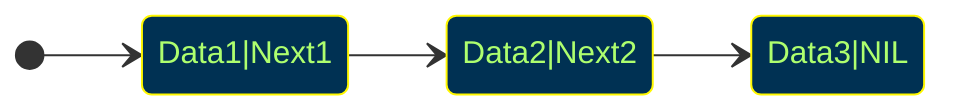
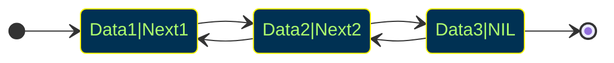

# Elementary Data Structures
- "Mankind's progress is measured by the number of things we can do without thinking."
- Elementary data structures such as stacks, queues, lists, and heaps are the "off-the-shelf" components we build out algorithm form.
- There are two aspects to any data structure:
    - The abstract operations which it supports.
    - The implementation of these operations.
<br></br>

## Data Abstraction
- That we can describe the behavior of our data structures in terms of abstract operations is why we can use them without thinking.
    - $\texttt{Push(x, s)}$: Insert item $\texttt{x}$ at the top of stack $\texttt{s}$.
    - $\texttt{Pop(s)}$: Return (and remove) the top item of stack $\texttt{s}$.
- That there are different implementations of the same abstract operations enables us to optimize performance in different circumstances.
<br></br>

## Contiguous vs. Linked Data Structures
- Data structures can be neatly classified as either *contiguous* or *linked* depending upon whether they are based on arrays or pointers:
    - Contiguously-allocated structures are composed of single slabs of memory, and include arrays, matrices, heaps, and hash tables.
    - Linked data structures are composed of multiple distinct chunks of memory bound together by pointers, and include lists, trees, and graph adjacency lists.
<br></br>

# Array
- A structure of fixed-size data records such that each element can be efficiently located by its *index* or (equivalently) address
- Advantage of contiguously-allocated arrays include:
    - Constant-time access given the index.
    - Arrays consist purely of data, so no space is wasted with links or other formatting information.
    - Physical continuity(memory locality) between successive data accessed helps exploit the high-speed cache memory on modern computer architectures.
<br></br>

## Dynamic Arrays
- The size of simple arrays cannot be changed in the middle of a program's execution.
- Compensating by allocating extremely large arrays can waste a lot of space.
- Start with an dynamic array of size 1, and double its size from $m$ to $2m$ each time when run out of space.
- How many times will we double for $n$ elements? $\to$ Only $\log_2{n}$
<br></br>

## How Much Total Work?
- The apparent waste in this procedure involves the recopying of the old contents on each expansion.
- If half the elements move once, a quarter of the elements twice, and so on, the total number of movements $M$ is:
$$M = \sum_{i=1}^{\lg{n}}{i\cdot n/2^i} = n\sum_{i=1}^{\lg{n}}{i/2^i}\le n\sum_{i=1}^{\infty}{i/2^i}=2n$$
- Thus, each of the $n$ elements move an average of only twice, and the total work of managing the dynamic array is the same $O(n)$ as a simple array.
<br></br>

## Sentinels
- Boundary conditions can be eliminated using a sentinel element which doesn't go away.
- Initializing the empty array of list to contain an item with key $\infty$ ensures that:
    - The empty list condition never can occur, and thus never needs to be tested.
    - No inserted element will ever be minimum, so insertion sort need never test for the boundary of the array.
- Nothing changes with the Big Oh, but this can simplify code if done correctly.
<br></br>

# Linked Structures
## Pointers and Linked Structures
- Pointers represent the address of a location in memory.
- A cell-phone number can be thought of as a pointer to its owner as they move about the planet.
- In C, $\texttt{*p}$ denotes the item pointed to by $\texttt{p}$, and $\texttt{\&}\texttt{x}$ denotes the address (i.e. pointer) of a particular variable $\texttt{x}$.
- A special $\texttt{NULL}$ pointer value is used to denote structure-terminating or unassigned pointers.
<br></br>

## Linked List Structures
```c
typedef struct list {
    item_type item;        /* data item */
    struct list *next;     /* point to successor */
} list;
```


<br></br>

## Searching a List
Searching in a linked list can be done iteratively or recursively.
```c
list *search_list(list *l, item_type x) {
    if (l == NULL) {
        return(NULL);
    }
    if (l->item == x) {
        return(l);
    } else {
        return(search_list(l->next, x));
    }
}
```
<br></br>

## Insertion into a List
Since we have no need to maintain the list in any particular order, we might as well insert each new item at the head.
```c
void insert_list(list **l, item_type x) {
    list *p;    /* temporary pointer */

    p = malloc(sizeof(list));
    p->item = x;
    p->next = *l;
    *l = p;
}
```
Note the $\texttt{**l}$, since the head element of the list changes.
<br></br>

## Deleting from a List: Find Predecessor
```c
list *item_ahead(list *l, list *x) {
    if ((l == NULL) || (l->next == NULL)) {
        return(NULL);
    }
    if ((l->next) == x) {
        return(l);
    } else {
        return(item_ahead(l->next, x));
    }
}
```
<br></br>

## Deleting from a List: Remove Item
```c
void delete_list(list **l, list **x) {
    list *p;            /* item pointer */
    list *pred;         /* predecessor pointer */

    p = *l;
    pred = item_ahead(*l, *x);

    if (pred == NULL) { /* splice out of list */
        *l = p->next;
    } else {
        pred->next = (*x)->next;
    }
    free(*x);           /* free memory used by node */
}
```
<br></br>

## Advantages of Linked Lists
The relative advantages of linked lists over static arrays include:
1. Overflow on linked structures can never occur unless the memory is actually full.
2. Insertions and deletions are *simpler* than for contiguous (array)lists.
3. With large records, moving pointers is easier and faster than moving the items themselves.
<br></br>

## Doubly Linked Lists

- Since the extra big-Oh costs of doubly-linked lists is zero, we will usually assume they are so maintained, altough it might not always be necessary.
<br></br>

# Containers
## Stacks and Queues
- Sometimes, the order in which we retrieve data is independent of its content, being only a function of when it arrived.
- A *stack* supports last-in, first-out operations:
    - $\texttt{Push(x, s)}$ - Insert item $\texttt{x}$ at the top of stack $\texttt{s}$.
    - $\texttt{Pop(s)}$ - Return (and remove) the top item of stack $\texttt{s}$.
- A *queue* supports first-in, first-out operations:
    - $\texttt{Enqueue(x, q)}$ - Insert item $\texttt{x}$ at the back of queue $\texttt{q}$.
    - $\texttt{Dequeue(q)}$ - Return (and remove) the front item from queue $\texttt{q}$.
<br></br>

## Stack/Queue Implementations
- Stacks are more easily represented as an array, with push/pop incrementing/decrementing a counter.
- Queue are more easily represented as linked list, with enqueue/dequeue operating on opposite ends of the list.
All operations can be done in $O(1)$ time for both structures, with both arrays and lists.
<br></br>

## Why Stacks and Queues?
- Both are appropriate for a container class where order doesn't matter, but sometime it does matter.
- Lines in banks are based on queues, while food in my refrigerator is treated as a stack.
- The entire difference between depth-first search (DFS) and breadth-first search (BFS) is whether a stack or a queue holds the vertices/items to be processed.
<br></br>

# Dictionary Data Structures
## Dictionary/Dynamic Set Operations
- Perhaps the most important class of data structures maintain a set of items, indexed by keys.
    - $\texttt{Search(S, k)}$ - A query that, given a set S and a key value $\texttt{k}$, returns a pointer $\texttt{x}$ to an element in $\texttt{S}$ such that $\texttt{key[x] = k}$, or $\texttt{NIL}$ if no such element belongs to $\texttt{S}$.
    - $\texttt{Insert(S, x)}$ - A modifying operation that augments the set $\texttt{S}$ with the element $\texttt{x}$.
    - $\texttt{Delete(S, x)}$ - Given a pointer $\texttt{x}$ to an element in the set $\texttt{S}$, remove $\texttt{x}$ from $\texttt{S}$. Observe we are given a pointer to an element $\texttt{x}$, not a key value.
    - $\texttt{Min(S)}$, $\texttt{Max(S)}$ - Returns the element of the totally ordered set $\texttt{S}$ which has the smallest (largest) key.
    - Logical $\texttt{Predecessor(S, x)}$, $\texttt{Successor(S, x)}$ - Given an element $\texttt{x}$ whose key is from a totally ordered set $\texttt{S}$, returns the next smallest (largest) element in $\texttt{S}$, or $\texttt{NIL}$ if $\texttt{x}$ is the maximum (minimum) element.
- There are a variety of implementations of these *dictionary* operations, each of which yield different time bounds for various operations.
- There is an inherent tradeoff between these operations. We will see that no single implementation will achieve the best time bound for all operations.
<br></br>

## Array Based Sets: Unsorted Arrays
- $\texttt{Search(S, k)}$ - sequential search, $O(n)$
- $\texttt{Insert(S, x)}$ - place in first empty spot, $O(1)$
- $\texttt{Delete(S, x)}$ - copy $\texttt{n}$ th item to the $\texttt{x}$ th spot, $O(n)$
- $\texttt{Min(S, x)}$, $\texttt{Max(S, x)}$ - sequential search, $O(n)$
- $\texttt{Successor(S, x)}$, $\texttt{Predecessor(S, x)}$ - sequential search, $O(n)$
<br></br>

## Array Based Sets: Sorted Arrays
- $\texttt{Search(S, k)}$ - binary search, $O(\lg{n})$
- $\texttt{Insert(S, x)}$ - search, then move to make space, $O(n)$
- $\texttt{Delete(S, x)}$ - move to fill up the hole, $O(n)$
- $\texttt{Min(S, x)}$, $\texttt{Max(S, x)}$ - first or last element, $O(1)$
- $\texttt{Successor(S, x)}$, $\texttt{Predecessor(S, x)}$ - Add or subtract 1 from pointer, $O(1)$