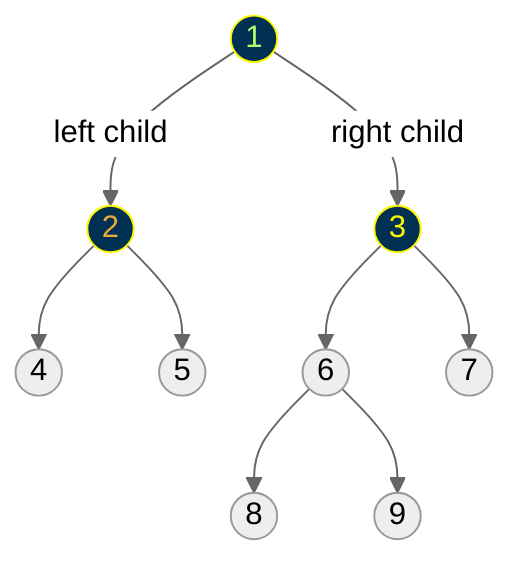
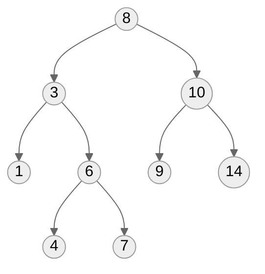
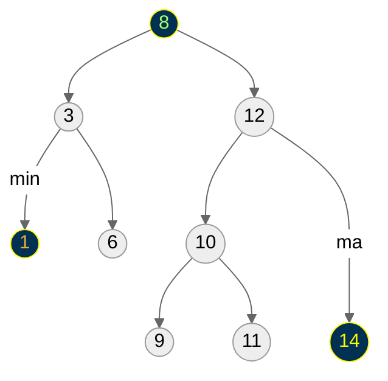
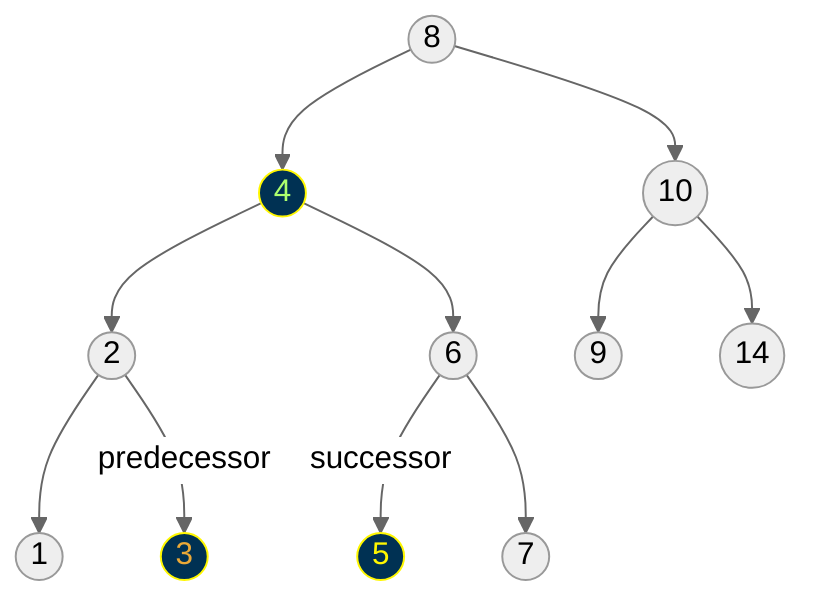
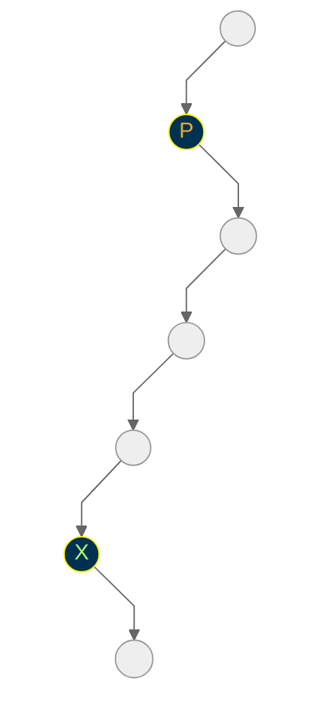
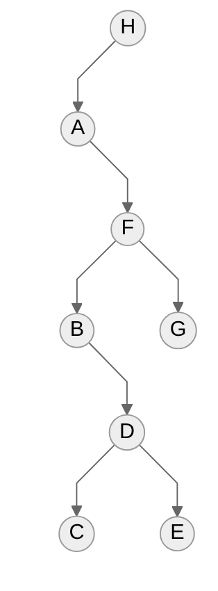
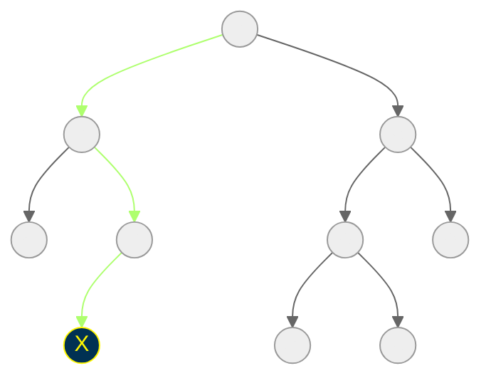
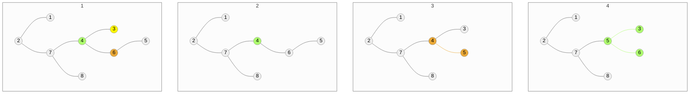
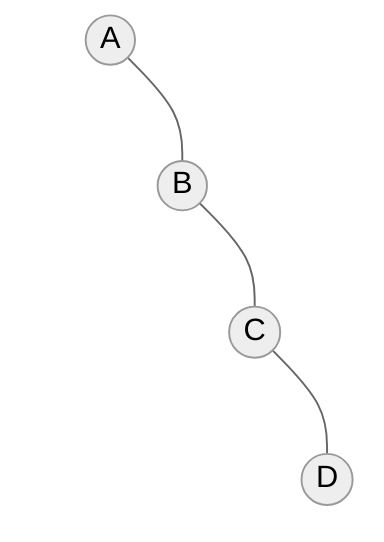
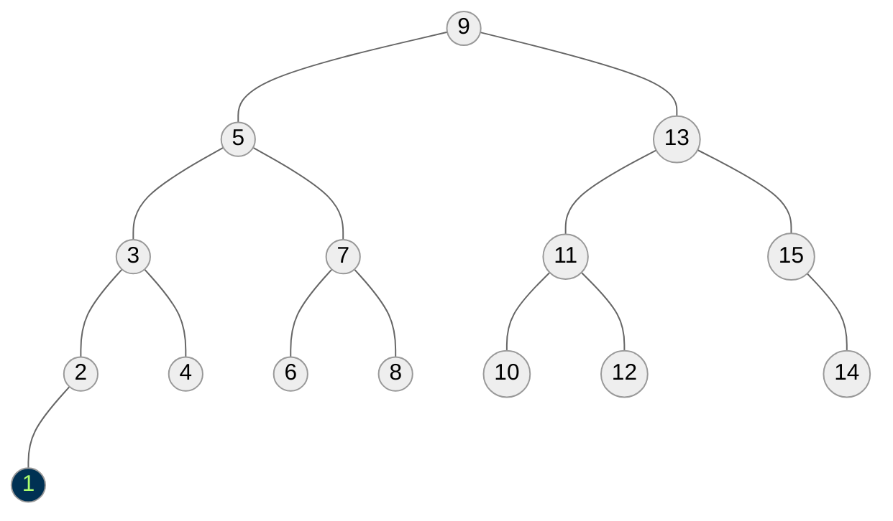

# Binary Search Trees
- Binary search trees provide a data structure which efficiently supports all six dictionary operations.
- A binary tree is a rooted tree where each node contains at most two children.
- Each child can be identified as either a left or right child.



- A binary *search* tree labels each node $\texttt{x}$ in a binary tree such that all nodes in the left subtree of $\texttt{x}$ have keys $\texttt{<x}$ and all nodes in the right subtree of $\texttt{x}$ have keys $\texttt{>x}$.


- The search tree labeling enables us to find where any key is.
<br></br>

## Implementing Binary Search Trees
```c
typedef struct tree {
    item_type item;        /* data item */
    struct tree *parent;   /* pointer to parent */
    struct tree *left;     /* pointer to left child */
    struct tree *right;    /* pointer to right child */
} tree;
```
The parent link is optional, since we can usually store the pointer on a stack when we encounter it.
<br></br>

## Searching in a Binary Tree: Implementation
```c
tree *search_tree(tree *l, item_type x) {
    if (l == NULL) {
        return(NULL);
    }
    if (l->item == x) {
        return(l);
    }
    if (x < 1->item) {
        return(search_tree(l->left, x));
    } else {
        return(search_tree(l->right, x));
    }
}
```
<br></br>

## Searching in a Binary Tree: How Much Time?
- The algorithm works because both the left and right subtrees of a binary search tree *are* binary search trees - recursive structure, recursive algorithm.
- This takes time proportional to the height of the tree, $O(h)$.
<br></br>

# Operations on Binary Search Trees
## Maximum and Minimum

<br></br>

## Finding the Minimum
```c
tree *find_minimum(tree *t) {
    tree *min;       /* pointer to minimum */

    if (t == NULL) {
        return(NULL);
    }
    min = t;
    while (min->left != NULL) {
        min = min->left;
    }
    return(min);
}
```
Finding the max or min takes time proportional to the height of the tree, $O(h)$.
<br></br>

## Where is the Predecessor?: Internal Node

If $\texttt{X}$ has two children, its predecessor is the maximum value in its left subtree and its successor the minimum value in its right subtree.
<br></br>

## Where is the Successor?: Leaf Node

- If it does not have a left child, a node's predecessor is its first left ancestor.
- The proof of correctness comes from looking at the in-order traversal of the tree.
<br></br>

## In-Order Traversal


```c
void traverse_tree(tree *l) {
    if (l != NULL) {
        traverse_tree(l->left);
        process_item(l->item);
        traverse_tree(l->right);
    }
}
```
- This traversal visits the nodes in $ABCDEFGH$ order.
- Because it spends $O(1)$ time at each of $n$ nodes in the tree, the total time is $O(n)$.
<br></br>

# Insertion and Deletion
## Tree Insertion
- Do a binary search to find where it should be, then replace the termination $\texttt{NIL}$ pointer with the new item.

- Insertion takes time proportional to tree height, $O(h)$.
<br></br>

## Tree Insertion Code
```c
void insert_tree(tree **l, item_type x, tree *parent) {
    tree *p;    /* temporary pointer */

    if (*l == NULL) {
        p = malloc(sizeof(tree));
        p->item = x;
        p->left = p->right = NULL;
        p->parent = parent;
        *l = p;
        return;
    }
    if (x < (*l)->item) {
        insert_tree(&((*l)->left), x, *l);
    } else {
        insert_tree(&((*l)->right), x, *l);
    }
}
```
<br></br>

## Tree Deletion
- Deletion is trickier than insertion, because the node to die may not be a leaf, and thus effect other nodes.
- There are three cases:
    - Case (a), where the node is a leaf, is simple: just $\texttt{NIL}$ out the parents child pointer.
    - Case (b), where a node has one child, the doomed node can just be cut out.
    - Case (v), relabel the node as its successor (which has at most one child when $x$ has two children!) and delete the successor!
<br></br>

## Cases of Deletion

From Left:
1. initial tree
2. delete leaf node (3)
3. delete node with 1 child (6)
4. delete node with 2 children (4)
<br></br>

# Balanced Binary Search Trees
## Binary Search Trees as Dictionaries
- All six of our dictionary operations, when implemented with binary search trees, take $O(h)$, where $h$ is the height of the tree.
- The best height we could hope to get is $\lg{n}$, if the tree was perfectly balanced, since
$$\sum_{i=0}^{|\lg{n}|}{2^i}\approx n$$
- But if we get unlucky with our order of insertion or deletion, we could get linear height!
<br></br>

## Tree Insertion: Worst Case Height

If we are unlucky in the order of insertion, and take no steps to rebalance, the tree can have height $\Theta{(n)}$.
<br></br>

## Tree Insertion: Average Case Analysis
- In fact, binary search trees constructed with *random* insertion orders *on average* have $\Theta{(\lg{n})}$ height.
- Why? Because half the time the insertion will be closer to the median key than an end key.
- Our future analysis of Quicksort will explain more precisely why the expected height is $\Theta{(\lg{n})}$.
<br></br>

## Perfectly Balanced Trees
- *Perfectly* balanced trees require a lot of work to maintain.



- If we insert the key 1, we must move every single node in the tree to rebalance it, taking $\Theta{(n)}$ time.
<br></br>

## Balanced Search Trees
- Therefore, when we talk about "balanced" trees, we mean trees whose height is $O(\lg{n})$, so all dictionary operations (insert, delete, search, min/max, successor/predecessor) take $O(\lg{n})$ time.
- No data structure can be better than $\Theta(\lg{n})$ in the worst case on all these operations.
- Extra care must be taken on insertion and deletion to guarantee such performance, by rearranging things when they get too lopsided.
- *Red-Black trees*, *AVL trees*, *2-3 trees*, *splay trees*, and *B-trees* are examples of balanced search trees used in practice and discussed in most data structure texts.
<br></br>

## Where Does the Log Come From?
- Often the logarithmic term in an algorithm analysis comes from using a balanced search tree as a dictionary, and performing many (say, $n$) operations on it.
- But often it comes from the idea of a balanced binary tree, partitioning the items into smaller and smaller subsets, and doing little work on each of $\log{(n)}$ levels.