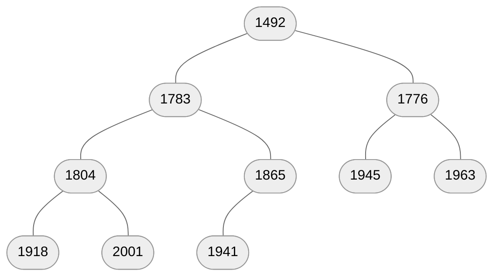

# Introduction to Sorting
## Importance of Sorting
- Computers spend a lot of time sorting, historically 25% on mainframes.
- Sorting is the best studied problem in computer science, with many different algorithms known.
- Most of the insteresting ideas we will encounter in the course can be taught in the context of sorting, such as divide-and-conquer, randomized algorithms, and lower bounds.
<br></br>

## Efficiency of Sorting
- Sorting is important because that once a set of items is sorted, many other problems become easy.
- Further, using $O(n\log{n})$ sorting algorithms leads naturally to sub-quadratic algorithms for all these problems.
<br></br>

## Pragmatics of Sorting: Comparison Functions
- Alphabetizing is the sorting of text strings.
- Explicitly controlling the order of keys is the job of the *comparison function* we apply to each pair of elements, including the question of increasing or decreasing order.
<br></br>

## Pragmatics of Sorting: Equal Elements
- Elements with equal keys will all bunch together in any total order, but sometimes the relative order among these keys matters.
- Often there are secondary keys (like first names) to test after the primary keys. This is a job for the comparison function.
- Certain algorithms (like quicksort) require special care to run efficiently with large numbers of equal elements.
<br></br>

## Pragmatics of Sorting: Library Functions
- Any reasonable programming language has a built-in sort routine as a library function.
- You are almost always better off using the system sort than writing your own routine.
- For example, the standard library for C contains the function $\texttt{qsort}$ for sorting:
```c
# include <stdlib.h>

void qsort(void *base, size_t nel, size_t width, int (*compare) (const void *, const void *));
```
<br></br>

# Applications of Sorting
## Applications of Sorting: Searching
- Binary search lets you test whether an item is in a dictionary in $O(\lg{n})$ time.
- Search preprocessing is perhaps the single most important application of sorting.
<br></br>

## Application of Sorting: Closest pair
- Given $n$ numbers, find the pair which are closest to each other.
- Once the numbers are sorted, the closest pair will be next to each other in sorted order, so an $O(n)$ linear scan completes the job.
<br></br>

## Applications of Sorting: Element Uniqueness
- Given a set of $n$ items, are they all unique or are there any duplicates?
- Sort them and do a linear scan to check all adjacent pairs.
- This is a special case of closest pair above.
<br></br>

## Application of Sorting: Mode
- Given a set of $n$ items, which element occurs the largest number of times? More generally, compute the frequency distribution.
- Sort them and do a linear scan to measure the length of all adjacent runs.
- The number of instances of $k$ in a sorted array can be found in $O(\log{n})$ time by using binary search to look for the positions of both $k - \epsilon$ and $k + \epsilon$.
<br></br>

## Application of Sorting: Median and Selection
- What is the $k$th largest item in the set?
- Once the keys are placed in sorted in an array, the $k$th largest can be found in constant time by simply looking in the $k$th position of the array.
- There is a linear time algorithm for this problem, but the idea comes from partial sorting.
<br></br>

## Application of Sorting: Convex hulls
- Given $n$ points in two dimensions, find the smallest area polygon which contains them all.
- The convex hull is like a rubber band stretched over the points.
- Convex hulls are the most important building block for more sophisticated geometric algorithms.
<br></br>

## Finding Convex Hulls
- Once you have the points sorted by x-coordinate, they can be inserted from left to right into the hull, since the rightmost point is always on the boundary.
- Sorting eliminates the need check whether points are inside the current hull.
- Adding a new point might cause others to be deleted.
<br></br>

# Selection Sort/Heapsort
## Selection Sort
- Selection sort scans through the entire array, repeatedly finding the smallest remaining element.

For $\texttt{i = 1}$ to $\texttt{n}$
A: Find the smallest of the first $\texttt{n - i + 1}$ items.
B: Pull it out of the array and put it first.

Selection sort takes $O(n(T(A)+T(B)))$ time.
<br></br>

## The Data Structure Matters
- Using arrays or unsorted linked lists as the data structure, operation $A$ takes $O(n)$ time and operation $B$ takes $O(1)$, for an $O(n^2)$ selection sort.
- Using balanced search trees or heaps, both of these operations can be done within $O(\lg{n})$ time, for an $O(n\log{n})$ selection sort called heapsort.
- Balancing the work between the operations achieves a better tradeoff.
<br></br>

# Priority Queues with Applications
## Priority Queues
- Priority queues are data structures which provide extra flexibility over sorting.
- This is important because jobs often enter a system at arbitrary intervals. It is more cost-effective to insert a new job into a priority queue than to re-sort everything on each new arrival.
<br></br>

## Priority Queue Operations
- The basic priority queue supports three primary operations:
    - $\texttt{Inser(Q, x)}$: Given an item $\texttt{x}$ with key $\texttt{k}$, insert it into the priority queue $\texttt{Q}$.
    - $\texttt{Find-Minimum(Q)}$ or $\texttt{Find-Maximum(Q)}$: Return a pointer to the item whose key is smaller (larger) than any other key in the priority queue $\texttt{Q}$.
- Each of these operations can be easily supported using heaps or balanced binary trees in $O(\log{n})$.
<br></br>

## Applications of Priority Queues: Discrete Event Simulations
- In simulations of airports, parking lots - priority queues can be used to maintain who goes next.
- The stack and queue orders are just special cases of orderings.
- In real life, certain people cut in line, and this can be modeled with a priority queue.
<br></br>

# Heaps
## Heap Definition
- A *binary heap* is defined to be a binary tree with a key in each node such that:
    1. All leaves are on, at most, two adjacent levels.
    2. All leaves on the lowest level occur to the left, and all levels except the lowest one are completely filed.
    3. The key in root is $\le$ all its children, and the left and right subtrees are again binary heaps.
- Conditions 1 and 2 specify shape of the tree, and condition 3 the labeling of the tree.
<br></br>

## Binary Heaps
- Heaps maintain a partial order on the set of elements which is weaker than the sorted order (so it can be efficient to maintain) yet stronger than random order (so the minimum element can be quickly identified).

|1|2|3|4|5|6|7|8|9|10|
|---|---|---|---|---|---|---|---|---|---|
|1492|1783|1776|1804|1865|1945|1963|1918|2001|1941|

<br></br>

## Array-Based Heaps
- The most natural representation of this binary tree would involve storing each key in a node with pointers to its two children.
- However, we can store a tree as an array of keys, using the position of the keys to *implicitly* satisfy the role of the pointers.
```c
typedef struct {
    item_type q[PQ_SIZE + 1];  /* body of queue */
    int n;                     /* number of queue elements */
} priority_queue;
```
```c
int pq_parent(int n) {
    if (n == 1) {
        return (-1);
    }
    return ((int) n / 2);  /* implicitly take floor(n / 2) */
}
```
```c
int pq_young_child(int n) {
    return (2 * n);
}
```
- The *left* child of $k$ sits in position $2k$ and the right child in $2k + 1$.
- The parent of $k$ is in position $\lfloor{n / 2}\rfloor$.
<br></br>

## Can we Implicitly Represent Any Binary Tree?
- The implicit representation is only efficient if the tree is sparse, meaning that the nnumber of nodes $n \lt 2^h$.
- All missing internal nodes still take up space in our structure.
- This is why we insist on heaps as being as balanced/full at each level at possible.
- The array-based representation is also not as flexible to arbitrary modifications as a pointer-based tree.
<br></br>

## Constructing Heaps
- Heaps can be constructed incrementally, by inserting new elements into the left-most open spot in the array.
- If the new element is greater than its parent, swap their positions and recur.
- Since all but the last level is always filled, the height $h$ of an $n$ element heap is bounded because:
$$\sum_{i = 1}^{h}{2^i} = 2^{h + 1} - 1\ge n$$
&nbsp;&nbsp;&nbsp;&nbsp;&nbsp;&nbsp;&nbsp;&nbsp;so $h = \lfloor \lg{n} \rfloor$.
- Doing $n$ such insertions really takes $\Theta{(n\log{n})}$, because the last $n/2$ insertions require $O(\log{n})$ time each.
<br></br>

### Heap Insertion
```c
void pq_insert(priority_queue *q, item_type x) {
    if (q->n >= PQ_SIZE) {
        printf("Warning: priority queue overflow!\n");
    } else {
        q->n = (q->n) + 1;
        q->q[q->n] = x;
        bubble_up(q, q->n);
    }
}
```
<br></br>

### Bubble Up
```c
void bubble_up(priority_queue *q, int p) {
    if (pq_parent(p) == -1) {
        return;    /* at root of heap, no parent */
    }

    if (q->q[pq_parent(p)] > q->q[p]) {
        pq_swap(q, p, pq_parent(p));
        bubble_up(q, pq_parent(p));
    }
}
```
<br></br>

### Construct Heap
```c
void pq_init(priority_queue *q) {
    q->n = 0;
}
```
```c
void make_heap(priority_queue *q, item_type s[], int n) {
    int i;        /* counter */

    pq_init(q);
    for (i = 0; i < n; i++) {
        pq_insert(q, s[i])
    }
}
```
<br></br>

## Extracting the Minimum Element
```c
item_type extract_min(priority_queue *q) {
    int min = -1;    /* minimum value */

    if (q->n <= 0) {
        printf("Warning: empty priority queue.\n");
    } else {
        min = q->q[1];

        q->q[1] = q->q[q->n];
        q->n = q->n - 1;
        bubble_down(q, 1);
    }
    return (min);
}
```
<br></br>

### Bubble Down Implementation
```c
void bubble_down(priority_queue *q, int p) {
    int c;            /* child index */
    int i;            /* counter */
    int min_index;    /* index of lightest child */

    c = pq_young_child(p);
    min_index = p;

    for (i = 0; i <= 1; i ++) {
        if ((c + i) <= q->n) {
            if (q->q[min_index] > q->q[c + i]) {
                min_index = c + i;
            }
        }
    }

    if (min_index != p) {
        pq_swap(q, p, min_index);
        bubble_down(q, min_index);
    }
}
```
<br></br>

# Faster Heap Construction
## An Even Faster Way to Build a Heap
Given two heaps and a fresh element, they can be merged into one by making the new one the root and bubbling down(heapify).
```c
void make_heap_fast(priority_queue *q, item_type s[], int n) {
    int i;        /* counter */

    q->n = n;
    for (i = 0; i < n; i++) {
        q->q[i + 1] = s[i];
    }

    for (i = q->n/2; i >= 1; i--) {
        bubble_down(q, i);
    }
}
```
<br></br>

## Exact Analysis of Heapify
- In fact, build-heap performs better than $O(n\log{n})$, because most of the heaps we merge are extremely small.
- It follows the same analysis as dynamic arrays.
- In a full binary tree on $n$ nodes, there are at most $\lceil n/2^{h + 1} \rceil$ nodes of height $h$, so the cost of building a heap is:
$$\sum_{h = 0}^{\lfloor \lg{n} \rfloor}{\lceil n/2^{h + 1}\rceil O(h)=O(n\sum_{h = 0}^{\lfloor \lg{n} \rfloor}{h/2^h})}$$
- Since this sum is not quite a geometric series, we can't apply the usual identify to get the sum. But it should be clear that the series converges.
<br></br>

## Proof of Convergence
- The identify for the sum of a geometric series is
$$\sum_{k = 0}^{\infty}{x^k} = \frac{1}{1-x}$$
- If we take the derivative of both sides,
$$\sum_{k = 0}^{\infty}{kx^{k - 1}} = \frac{1}{(1-x)^2}$$
- Multiplying both sides of the equation by $x$ gives:
$$\sum_{k = 0}^{\infty}{kx^k} = \frac{x}{(1 - x)^2}$$
- Substituting $x = 1/2$ gives a sum of 2, so Build-heap uses at most $2n$ comparisons and thus linear time.
<br></br>

## Heapsort
- Heapify can be used to construct a heap, using the observation that an isolated element forms a heap of size 1.
```c
void heapsort_(item_type s[], int n) {
    int i;               /* counters */
    priority_queue q;    /* heap for heapsort */

    make_heap(&q, s, n);

    for (i = 0; i < n; i++) {
        s[i] = extract_min(&q);
    }
}
```
- Exchanging the maximum element with the last element and calling heapify repeatedly gives an $O(n\log{n})$ sorting algorithm.
- By building the heap in the original array and carefully placing the min element in the hole left by extraction.