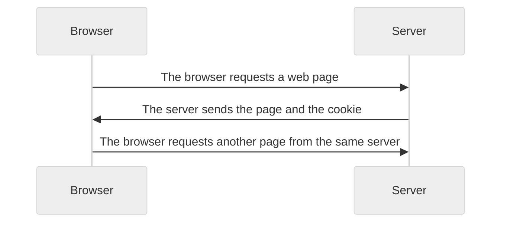

# Cookie

- 서버가 사용자의 웹 브라우저에 전송하는 작은 데이터 조각
- 클라이언트 측에서 저장되는 작은 데이터 파일
- 사용자 인증, 사용자 추적, 상태 유지 등에 사용된다.

## 쿠키 사용 예시
1. 브라우저(클라이언트)는 쿠키를 로컬에 `key-value` 형식으로 저장한다.
2. 클라이언트는 동일한 서버에 재요청시 저장된 쿠키를 함께 전송한다.
- 쿠키는 두 요청이 동일한 브라우저에서 들어왔는지 여부를 판단할 때 주로 사용된다.
- 상태가 없는(stateless) HTTP 프로토콜에서 상태 정보를 기억시키기 때문에 로그인 상태 유지 등과 같은 일을 할 수 있다.

## 쿠키 사용 목적
1. 세션 관리(Session management): 로그인, 아이디 자동완성 등 정보 관리
2. 개인화(Personalization): 사용자 선호, 테마 등 설정
3. 트래킹(Tracking): 사용자 행동을 기록 및 분석

## 쿠키 종류별 수명(lifetime)
1. Session cookie
  - 현재 세션(current session)이 종료되면 삭제된다.
  - 브라우저 종료와 함께 세션이 삭제된다.
2. Persistent cookie
  - `Expires` 속성에 지정된 날짜 혹은 `Max-Age` 속성에 지정된 기간이 지나면 삭제된다.
  

# Session
- 서버 측에서 생성되어 클라이언트와 서버 간의 상태를 유지한다.
- 상태 정보를 저장하는 데이터 저장 방식
- 쿠키에 세션 데이터를 저장하여 요청할 때마다 세션 데이터를 함께 보낸다.

## 세션 작동 예시
1. 클라이언트가 로그인을 하면 서버가 세션 데이터를 생성 후 저장한다.
2. 생성된 세션 데이터에 인증할 수 있는 세션 id를 발급한다.
3. 발급한 세션 id를 클라이언트에게 응답한다.
4. 클라이언트는 응답 받은 세션 id를 쿠키에 저장한다.
5. 클라이언트가 다시 동일한 서버에 접속하면 요청과 함께 세션 id가 저장된 쿠키를 서버에 전달한다.
6. 쿠키는 요청 때마다 서버에 함께 전송되므로 서버에서 세션 id를 확인해 로그인이 되어있다는 것을 알게 한다.

## Session in Django
- Django는 `Database-backed sessions` 저장 방식을 기본값으로 사용한다.
- 세션 정보는 DB의 `django_session` 테이블에 저장된다.
- Django는 특정 세션 id를 포함하는 쿠키를 사용해 각각의 브라우저와 사이트가 연결된 세션을 알아낸다.
  

# 쿠키와 세션을 사용하는 이유
클라이언트와 서버 간의 상태를 유지하기 위함이다.