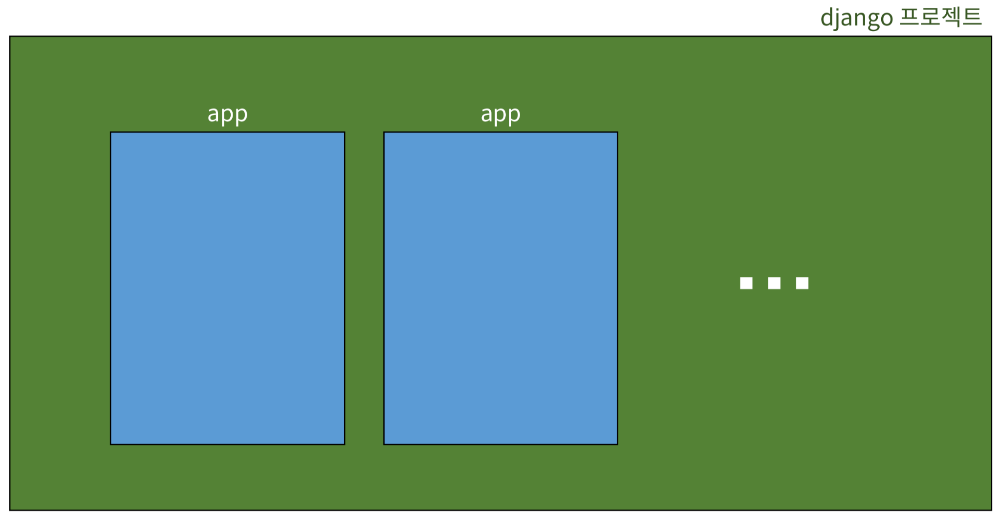
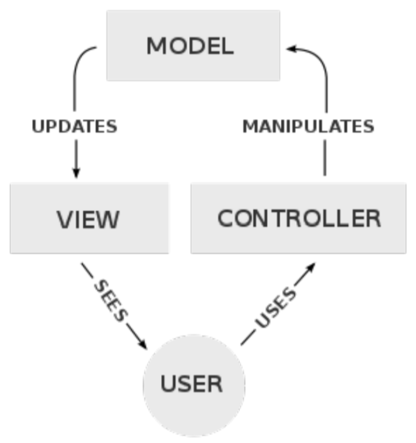
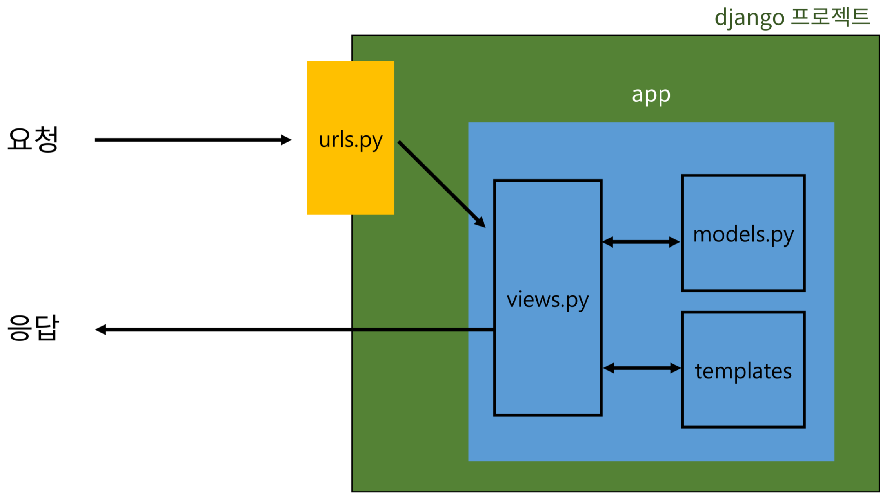

# Django 프로젝트와 앱
<br>

## Django project
- 애플리케이션의 집합
- DB 설정, URL 연결, 전체 앱 설정 등을 처리한다.
## Django application
- 독립적으로 작동하는 기능 단위 모듈
- MTV 패턴에 해당하는 파일 및 폴더를 담당한다.
- 각자 특정한 기능을 담당하며 다른 앱들과 함께 하나의 프로젝트를 구성한다.

## 앱 생성과 앱 등록
```bash
# 앱 생성
# 앱의 이름은 복수형으로 지정하는 것을 권장한다.
$ python manage.py startapp articles


# 앱 등록
# 반드시 앱을 생성한 후에 등록해야 한다.
# 등록 후 생성은 불가능하다.

# settings.py
INSTALLED_APPS = [
  'articles',
  'django.contrib.admin',
  'django.contrib.auth',
  'django.contrib.contenttypes',
  'django.contrib.sessions',
  'django.contrib.messages',
  'django.contrib.staticfiles',  
]
```
<br><br>

# Django 디자인 패턴
## (소프트웨어) 디자인 패턴
- 소프트웨어 설계에서 발생하는 발생하는 문제를 해결하기 위한 일반적인 해결책
- 공통적인 문제를 해결하는데 쓰이는 형식화 된 관행

## MVC 디자인 패턴
<br>
- Model-View-Controller
- 애플리케이션을 구조화하는 대표적인 패턴
- 데이터, 사용자 인터페이스, 비즈니스 로직을 분리한다.
- 시각적 요소와 뒤에서 실행되는 로직을 서로 영향 없이 독립적이고 쉽게 유지보수할 수 있는 애플리케이션을 만들기 위해 사용한다.

## MTV 디자인 패턴
- Model-Template-View
- Django에서 애플리케이션을 구조화하는 패턴
- 기존 MVC 패턴과 동일하나 명칭을 다르게 정의한다.
- $\texttt{View} \rightarrow \texttt{Template}$, $\texttt{Controller} \rightarrow \texttt{View}$

## 프로젝트 구조
<br>

- $\texttt{settings.py}$
    - 프로젝트의 모든 설정을 관리한다.
- $\texttt{urls.py}$
    - URL과 이에 해당하는 적절한 `views`를 연결한다.
- __ $\texttt{init}$ __ $\texttt{.py}$
    - 해당 폴더를 패키지로 인식하도록 설정한다.
- $\texttt{asgi.py}$
    - 비동기식 웹 서버와의 연결 관련 설정
- $\texttt{wsgi.py}$
    - 웹 서버와의 연결 관련 설정
- $\texttt{manage.py}$
    - Django 프로젝트와 다양한 방법으로 상호작용하는 커맨드라인 유틸리티
- $\texttt{admin.py}$
    - 관리자용 페이지 설정
- $\texttt{models.py}$
    - DB와 관련된 Model을 정의한다.
    - `MTV` 패턴의 `M`
- $\texttt{views.py}$
    - HTTP 요청을 처리하고 해당 요청에 대한 응답을 반환한다. (url, mode, template와 연계)
    - `MTV` 패턴의 `V`
- $\texttt{apps.py}$
    - 앱의 정보가 작성되는 곳
- $\texttt{tests.py}$
    - 프로젝트 테스트 코드를 작성하는 곳
<br><br>

# 요청과 응답
## URLs
```python
# urls.py

from django.contrib import admin
from django.urls import path
from articles import views

urlpatterns = [
    path('admin/', admin.site.urls), 
    path('articles/', views.index),
]
```
$\texttt{http:// 128.0.0.1:8000 / articles /}$로 요청이 들어왔을 때 `views` 모듈의 `index` 뷰 함수를 호출하는 예시

## View
```python
# views.py

from django.shortcuts import render

def index(request):
    return render(request, 'articles/index.html')
```
특정 경로에 있는 `template`와 `request` 객체를 결합해 응답 객체를 반환하는 `index` 뷰 함수를 정의하는 예시

## Template
```html
<!-- articles/index.html -->

<! DOCTYPE html>
<html lang="en">
<head>
  ...
  <title>Document</title>
</head>
<body>
  <h1>Hello, There</h1>
</body>
</html>
```
1. `articles` 앱 폴더 안에 `templates` 폴더를 생성한다.
    - 반드시 이름이 `templates`여야 하며 직접 생성해야 한다.
2. `templates` 폴더 안에 템플릿 페이지를 작성한다.

### Django에서 template를 인식하는 경로 규칙
$\texttt{app dir / templates / articles / index.html}$<br>
$\texttt{app dir / templates / example.html}$

Django는 $\texttt{app dir / templates / }$까지 기본 경로로 인식하기 때문에 이 지점 이후의 template 경로를 작성해야 한다.

## 데이터 흐름에 따른 코드 작성
- URLs $\rightarrow$ View $\rightarrow$ Template
- URLs
    ```
    path('articles/', views.index), 
    ```
- View
    ```python
    def index(request):
        return render(request, 'articles/index.html')
    ```
- Template
    ```
    articles/templates/articles/index.html
    ```