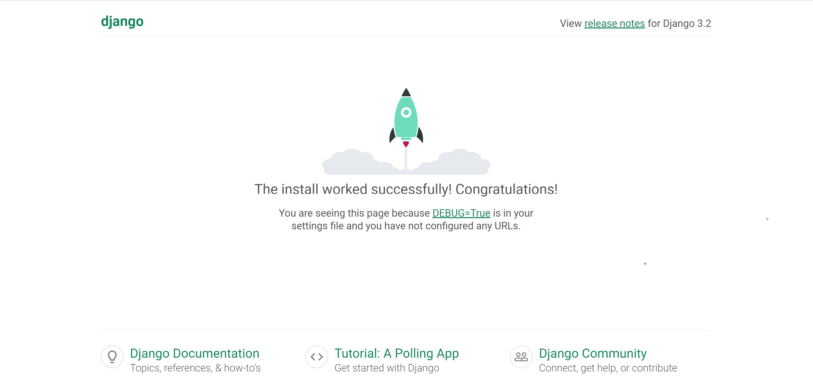

```bash
# 1. 가상환경 생성 및 활성화
$ python -m venv venv
$ source venv/Scripts/activate

# 2. Django 설치
$ pip install django==3.2.18

# 3. 의존성 파일 requirements.txt 생성
$ pip freeze > requirements.txt

# 4. Django 프로젝트 생성
$ django-admin startproject PROJECT_NAME .

# 5. Django 서버 실행
$ python manage.py runserver
```

Django 서버를 실행한 후 브라우저에서 `http://127.0.0.1:8000/`로 접속하면 다음과 같은 화면이 나타난다.<br>


번외. git 사용 시 설정
- gitignore 설정<br>
    [gitignore.io](https://gitignore.io/)를 활용하면 쉽게 `.gitignore`파일을 생성할 수 있다.
- gitignore?<br>
    [참조](/git/about.md/#gitignore)