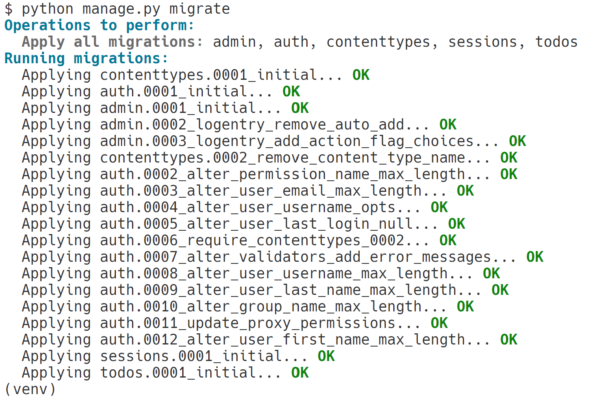
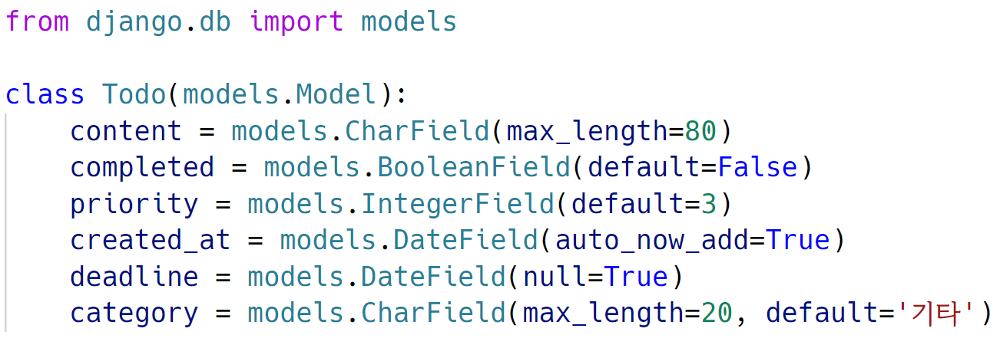
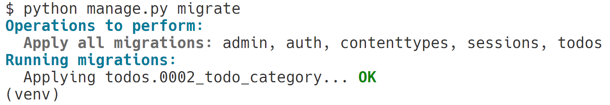

# 초기 설정
```bash
# 1. 가상환경 생성 및 활성화
$ python -m venv venv
$ source venv/Scripts/activate

# 2. Django 설치
$ pip install django==3.2.18

# 3. 의존성 파일 requirements.txt 생성
$ pip freeze > requirements.txt

# 4. Django 프로젝트 생성
$ django-admin startproject PROJECT_NAME .

# 5. Django 서버 실행
$ python manage.py runserver

# 6. 앱 생성
$ python manage.py startapp APP_NAME

# 7. 앱 등록
# settings.py의 'INSTALLED_APPS'에 'APP_NAME'을 추가한다.
```

Django 서버를 실행한 후(5번) 브라우저에서 `http://127.0.0.1:8000/`로 접속하면 다음과 같은 화면이 나타난다.<br>
<br>

번외. git 사용 시 설정
- gitignore 설정<br>
    [gitignore.io](https://gitignore.io/)를 활용하면 쉽게 `.gitignore`파일을 생성할 수 있다.
- gitignore?<br>
    [참조](/git/about.md/#gitignore)
<br><br>

# model
## model migration
### app의 `model.py`에서 model class을 작성한다.
<br>

### $\texttt{makemigrations}$ 명령어를 이용해 migration 파일을 생성한다.
<br>

### $\texttt{migrate}$ 명령어를 이용해 DB에 반영한다.
<br>

## add field
### app의 `model.py`를 수정한다.
<br>

### $\texttt{makemigrations}$ 명령어를 이용해 migration 파일을 생성한다.
#### `default`를 지정하지 않았을 때
<br>
1. 이 상태에서 기본값 지정하기
2. 나간 후 `model.py`에서 기본값 지정하기

##### 1을 선택했을 때
<br>

#### `default`를 지정했을 때
<br>

### $\texttt{migrate}$ 명령어를 이용해 DB에 반영한다.
<br>

## create superuser
### $\texttt{createsuperuser}$ 명령어를 이용해 관리자 계정을 생성한다.
<br>
- email: 선택사항
- password: 보안상 터미널에 출력되지 않는다.

### 모델 클래스 등록
<br>
`admin.py`에 등록하지 않으면 해당 모델을 admin site에서 확인할 수 없다.

## admin page
### `address/admin/`에 접속한다.
<br>

### 관리자 페이지
<br>

## 데이터베이스 파일 접근
1. `Visual Studio Code`에서 `SQLite Viewr` 확장 프로그램을 설치한 후 `db.sqlite3` 파일을 연다.
2. 왼쪽 메뉴에서 해당하는 모델을 선택한다.<br>
<br>

3. 열었을 때의 상태<br>
<br>