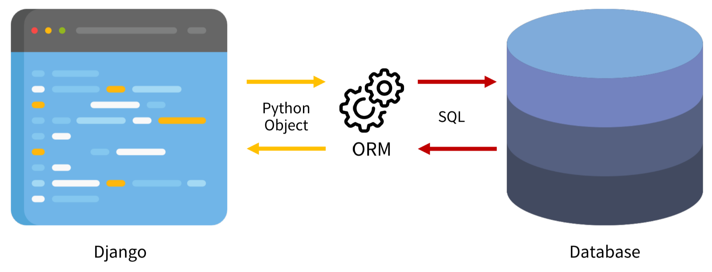
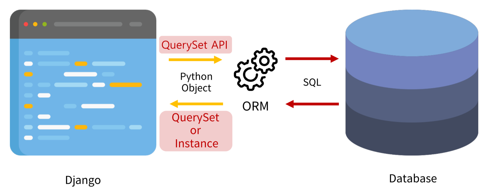

# ORM


- Object-Relational-Mapping
- 호환되지 않는 유형의 시스템 간의 데이터를 변환하는 프로그래밍 기술
- 객체 지향 프로그래밍 언어를 사용한다.
<br><br>

# QuerySet API


- ORM에서 데이터를 검색, 필터링, 정렬 및 그룹화하는데 사용하는 도구
- API를 사용하여 SQL이 아닌 Python 코드로 데이터를 처리한다.

## QuerySet API 구문
```python
Article.objects.all()

# Article: Model class
# objects: Manager
# all(): QuerySet API
```

## Query
- 데이터베이스에 특정한 데이터를 보여 달라는 요청
- 쿼리문을 작성한다<br>
  $\rightarrow$ 원하는 데이터를 얻기 위해 데이터베이스에 요청을 보낼 코드를 작성한다.
- 파이썬으로 작성한 코드가 ORM에 의해 SQL로 변환되어 데이터베이스에 전달된다.
- 데이터베이스의 응답 테이터를 ORM이 QuerySet이라는 자료 형태로 변환하여 제공한다.

## QuerySet
- 데이터베이스가 전달한 객체 목록(데이터 모음)
  - Iterable한 데이터로, 1개 이상의 데이터를 불러와 사용할 수 있다.
- Django ORM을 통해 만들어진 자료형
- 데이터베이스가 단일한 객체를 반환할 때에는 QuerySet이 아니라 모델(Class)의 인스턴스로 반환한다.
<br><br>

# ORM CREATE
## 외부 라이브러리 설치, 설정
```bash
$ pip install ipython
$ pip install django-extensions
```
```python
# settings.py

INSTALLED_APPS = [
    'articles',
    'django_extensions',
    ...,
]
```
```bash
$ pip freeze > requirements.txt
```

## Django Shell
- Django 환경 안에서 실행되는 Python Shell
- 입력하는 QuerySet API 구문이 Django 프로젝트에 영향을 미친다.

## 데이터 객체 생성 방법
### 첫 번째 방법
```python
# 특정 테이블에 새로운 행을 추가하여 데이터 추가
>>> article = Article() # Class Article, Instance article
>>> article
<Article: Article object (None)>

>>> article.title = 'Jedi' # 인스턴스 변수(title)에 값 할당
>>> article.content = 'Skywalker' # 인스턴스 변수(content)에 값 할당

# save를 하지 않으면 DB에 값이 저장되지 않는다
>>> article
<Article: Article object (None)>

>>> Article.objects.all()
<QuerySet []>

# save
>>> article.save()
>>> article
<Article: Article object (1)>
>>> article.id
1
>>> article.pk
1
>>> Article.objects.all()
<QuerySet [Article: Article object (1)]>

# 인스턴스 article을 활용하여 변수에 접근하기
>>> article.title
'Jedi'
>>> article.content
'Skywalker'
>>> article.created_at
datetime.datetime(2023, 3, 28, 1, 45, 49, 711676, tzinfo=<UTC>)
```

### 두 번째 방법
```python
>>> article = Article(title='Sith', content='Palpatine')

# 아직 저장하지 않았다
>>> article
<Article: Article object (None)>

# save를 호출해야 저장된다
>>> article.save()
>>> article
<Article: Article object (2)>
>>> Article.objects.all()
<QuerySet [<Article: Article object (1)>, <Article: Article object (2)>]>

# 값 확인
>>> article.pk
2
>>> article.title
'Sith'
>>> article.content
'Palpatine'
```

### 세 번째 방법
```python
# 바로 생성된 데이터가 반환된다
# QuerySet API의 create() 메서드 활용
>>> Article.objects.create(title='Mandalorian', content='Djarin')
<Article: Article object (3)>
```
<br><br>

# ORM READ
## 전체 데이터 조회: $\texttt{all()}$
```python
>>> Article.objects.all()
<QuerySet [<Article: Article object (1)>, <Article: Article object (2)>, <Article: Article object (3)>]>
```

## 단일 데이터 조회: $\texttt{get()}$
```python
>>> Article.objects.get(pk=1)
<Article: Article object (1)>

>>> Article.objects.get(pk=100)
DoesNotExist: Article matching query does not exist.

>>> Article.objects.get(content='Djarin')
<Article: Article object (3)>
# 만약 조건에 해당되는 데이터가 여러 개일 경우
# MultipleObjectsReturned: get() returned more than one Article -- it returned (number)!
# 메시지가 출력된다
```
- 객체를 찾을 수 없으면 `DoesNotExist` 예외를 발생시킨다.
- 두 개 이상의 객체를 찾으면 `MultipleObjectsReturned` 예외를 발생시킨다.
- `Primary Key`처럼 고유성(uniqueness)을 보장하는 조회에서 사용해야 한다.

## 특정 조건 데이터 조회: $\texttt{filter()}$
```python
>>> Article.objects.filter(content='Skywalker')
<QuerySet[<Article: Article object (1)>]>

>>> Article.objects.filter(title='Hero With No Fear')
<QuerySet[]>

>>> Article.objects.filter(title='Jedi')
<QuerySet[<Article: Article object (1)>]>
```

## Field Lookups
- 특정 레코드에 대한 조건을 설정하는 방법
- QuerySet 메서드 $\texttt{filter()}$, $\texttt{exclude()}$, $\texttt{get()}$에 대한 키워드 인자로 지정된다.
```python
# content 컬럼에 'Pal'이 포함된 모든 데이터 조회
Article.objects.filter(content__contains='Pal')
```