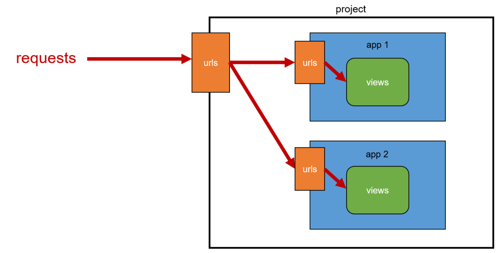

# URL dispatcher
URL 패턴을 정의하고 해당 패턴이 일치하는 요청을 처리할 `view` 함수를 연결(mapping)한다.
<br><br>

# 변수와 URL
## Variable Routing
```python
# <path_converter:variable_name>

path('articles/<int:num>/', views.hello)
path('hello/<str:name>/', views.greeting)
```
- URL 일부에 변수를 포함시키는 것
- 변수는 `view`함수의 인자로 전달할 수 있다.

## Path converters
- URL 변수의 타입을 지정한다.
- `str`, `int` 등 5가지 타입을 지원한다.
<br><br>

# App의 URL
## App URL mapping
<br>

```python
# project/urls.py

from django.contrib import admin
from django.urls import path, include

urlpatterns = [
    path('admin/', admin.site.urls),
    path('app1/', include('app1.urls')),
    path('app2/', include('app2.urls')),
]


# app1/urls.py

from django.urls import path
from . import views

urlpatterns = [
    path('page1/', views.func1),
    path('page2/', views.func2),
]


# app2/urls.py

from django.urls import path
from . import views

urlpatterns = [
    path('page1/', views.func1),
    path('page2/', views.func2),
]
```

- 각 앱에 URL을 정의하는 것
- 프로젝트와 각각의 앱이 URL을 나누어 관리하여 주소 관리를 편하게 하기 위해 사용한다.

### $\texttt{include()}$
- 다른 URL들을 참조할 수 있도록 돕는 함수
- URL의 그 시점까지 일치하는 부분을 잘라내고 남은 문자열 부분을 후속 처리를 위해 `include`된 URL로 전달한다.
<br><br>

# URL 이름 지정
## Naming URL patterns
- URL에 이름을 지정하는 것
- `path` 함수의 `name` 인자를 정의해서 사용한다.

### `name` 인자 작성
```python
from django.urls import path
from . import views

urlpatterns = [
    path('page1/', views.func1, name='page1'),
    path('page2/', views.func2, name='page2'),
]
```

### URL 표기 변화
```html
<!-- before -->




  <h1>Hello, {{ name }}</h1>
  <a href="/dinner/">dinner</a>
  <a href="/search/">search</a>
  <a href="/throw/">throw</a>


<!-- after -->




  <h1>Hello, {{ name }}</h1>
  <a href="">dinner</a>
  <a href="">search</a>
  <a href="">throw</a>

```
`href` 속성 값 뿐만 아니라 `form`의 `action` 속성처럼 url을 작성하는 모든 위치에서 변경된다.

## $\texttt{url}$ tag
```html

```
주어진 URL 패턴의 이름과 일치하는 절대 경로 주소를 반환한다.
<br><br>

# URL Namespace
## $\texttt{app}$ _ $\texttt{name}$ 속성 지정
```python
# app1/urls.py

app_name = 'app1'
urlpatterns = [
    ...,
]
```
- `app_name`을 지정한 후에는 url 태그에서 `app_name:url_name` 형태로만 사용할 수 있다.
- 그렇게 하지 않을 경우 `NoReverseMatch` 에러가 발생한다.

### URL tag의 변화
```html
<!-- before -->


<!-- after -->

```