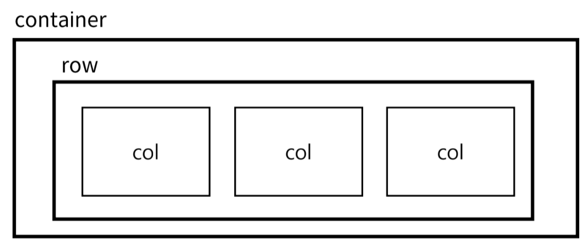

# Bootstrap
반응형 웹 디자인, CSS 및 JS 기반의 컴포넌트와 스타일을 제공하는 프론트엔드 라이브러리
<br><br>

# Typography
## Heading
```html
<p class="h1">h1. Bootstrap heading</p>
<p class="h2">h2. Bootstrap heading</p>
<p class="h3">h3. Bootstrap heading</p>
<p class="h4">h4. Bootstrap heading</p>
<p class="h5">h5. Bootstrap heading</p>
<p class="h6">h6. Bootstrap heading</p>
```
`HTML` $\texttt{h1}$ ~ $\texttt{h6}$ 태그와 스타일을 일치시키고 싶으나 관련 `HTML` 태그를 더 이상 사용할 수 없는 경우 사용한다.

## Display heading
```html
<h1 class="display-1">Display 1</h1>
<h1 class="display-2">Display 2</h1>
<h1 class="display-3">Display 3</h1>
<h1 class="display-4">Display 4</h1>
<h1 class="display-5">Display 5</h1>
<h1 class="display-6">Display 6</h1>
```
기존 Heading보다 더 눈에 띄는 제목이 필요한 경우 사용한다.

## Inline text elements
```html
<p>You can use the mark tag to <mark>highlight</mark> text.</p>
<p><del>This line of text is meant to be treated as deleted text.</del></p>
<p><s>This line of text is meant to be treated as no longer accurate.</s></p>
<p><ins>This line of text is meant to be treated as an addition to the document.</ins></p>
<p><u>This line of text will render as underlined.</u></p>
<p><small>This line of text is meant to be treated as fine print.</small></p>
<p><strong>This line rendedred as bold text.</strong></p>
<p><em>This line rendered as italicized text.</em></p>
```
`HTML` inline 요소에 대한 스타일

## List
```html
<ul class="list-unstyled">
  <li>This is a list.</li>
  <li>It appears completely unstyled.</li>
  <li>Structurally, it's still a list.</li>
  <li>However, this style only applies to immediate child elements.</li>
  <li>Nested lists:
    <ul>
      <li>are unaffected by this style</li>
      <li>will still show a bullet</li>
      <li>and have appropriate left margin</li>
    </ul>
  </li>
  <li>This may still come in handy in some situations.</li>
</ul>
```
`HTML` list 요소에 대한 스타일
<br><br>

# Bootstrap Color System
Bootstrap이 지정하고 제공하는 색상 시스템

## Colors
Text, Border, Background 및 다양한 요소에 사용하는 Bootstrap의 색상 키워드

## Text colors
```html
<p class="text-primary">.text-primary</p>
<p class="text-primary-emphasis">.text-primary-emphasis</p>
<p class="text-secondary">.text-secondary</p>
<p class="text-secondary-emphasis">.text-secondary-emphasis</p>
<p class="text-success">.text-success</p>
<p class="text-success-emphasis">.text-success-emphasis</p>
<p class="text-danger">.text-danger</p>
```

## Background colors
```html
<div class="p-3 mb-2 bg-primary text-white">.bg-primary</div>
<div class="p-3 mb-2 bg-primary-subtle text-emphasis-primary">.bg-primary-subtle</div>
<div class="p-3 mb-2 bg-secondary text-white">.bg-secondary</div>
<div class="p-3 mb-2 bg-secondary-subtle text-emphasis-secondary">.bg-secondary-subtle</div>
<div class="p-3 mb-2 bg-success text-white">.bg-success</div>
<div class="p-3 mb-2 bg-success-subtle text-emphasis-success">.bg-success-subtle</div>
<div class="p-3 mb-2 bg-danger text-white">.bg-danger</div>
```
<br><br>

# Bootstrap Component
Bootstrap에서 제공하는 UI 관련 요소
<br><br>

## Bootstrap Grid System
웹페이지의 레이아웃을 조정하는데 사용하는 12개의 칼럼으로 구성된 시스템<br>
반응형 디자인을 지원해 웹페이지를 다양한 기기에서 적절하게 표시할 수 있도록 돕는다.

### Grid system 핵심 클래스


```html
<div class="container">
  <div class="row">
    <div class="col-4"></div>
    <div class="col-4"></div>
    <div class="col-4"></div>
  </div>
</div>
```
1개의 row 안에 12칸의 column 영역으로 구성된다.<br>
각 요소는 12칸 중 몇 개를 점유할 것인지 지정된다.

### Gutters
Grid system에서 column과 column 사이에 있는 padding 영역
<br><br>

# Grid system breakpoints
웹페이지를 다양한 화면 크기에서 적절하게 배치하기 위한 분기점<br>
각 분기점마다 설정된 최대 너비 값 *이상으로* 화면이 커지면 grid system 동작이 변경된다.