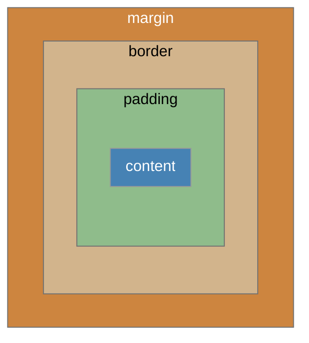

# CSS
- **C**ascading **S**tyle **S**heet
- 웹 페이지의 디자인과 레이아웃을 구성하는 언어

## CSS 적용방법
## Inline
```html
<!DOCTYPE html>
<html lang="en">
<head>
...
</head>
<body>
  <h1 style="color:#FFF700; background-color:#003153;">Hello, there.</h1>
</body>
```

## Internal
```html
<!DOCTYPE html>
<html lang="en">
<head>
...
  <title>Obi-Wan met R2-D2</title>
  <style>
    h1 {
        color:#FFF700;
        background-color:#003153;
    }
  </style>
</head>
<body>
  <h1>Hello, there.</h1>
</body>
```


## External
```html
<!DOCTYPE html>
<html lang="en">
<head>
...
  <link rel="stylesheet" href="style.css">
  <title>Obi-Wan met R2-D2</title>
</head>
<body>
  <h1>Hello, there.</h1>
</body>
```
```css
/* style.css*/
h1 {
  color:#FFF700;
  background-color:#003153;
}
```
<br><br>

# CSS Selectors
- HTML 요소를 선택하여 스타일을 적용할 수 있게 한다.

## CSS Selectors 종류
- 기본 선택자
    - 전체(`*`) 선택자
    - 요소(`tag`) 선택자
    - 클래스(`class`) 선택자
    - 아이디(`id`) 선택자
    - 속성(`attr`) 선택자
- 결합자(Combinators)
    - 자손결합자(` `)
    - 자식 결합자(`>`)

## CSS Selectors 특징
- 요소 선택자: 지정한 모든 태그를 선택한다.
- 클래스 선택자
    - 주어진 클래스 속성을 가진 모든 요소를 선택한다.
    - ex) `.index`는 `class="index"`를 가진 모든 요소를 선택한다.
- 아이디 선택자
    - 주어진 아이디 속성을 가진 요소를 선택한다.
    - 문서에는 주어진 아이디를 가진 요소가 하나만 있어야 한다.
    - ex) `#index`는 `id="index"`를 가진 요소를 선택한다.
- 자손 선택자(The space combinator)
    - 첫 번째 요소의 자손 요소들을 선택한다.
    - ex) `p span`은 `<p>` 안에 있는 모든 `<span>`을 선택한다.
- 자식 선택자
    - 첫 번째 요소의 직계 자식만 선택한다.
    - ex) `ul > li`는 `<ul>` 안에 있는 모든 `li`를 선택한다.

# Cascade & Specificity
## Cascade
- 동일한 우선순위를 가지는 규칙이 적용될 때 마지막에 나오는 규칙이 적용된다.
- 아래 예시의 경우: `blue`가 적용된다.
```CSS
h1 {
    color:red;
}

h1 {
    color:blue;
}
```

## Specificity
- 선택자 별로 정해진 우선순위에 따라 높은 우선순위를 가지는 규칙이 적용된다.
- 아래 예시의 경우: `red`가 적용된다.
```CSS
.make-red {
    color:red;
}

h1 {
    color:blue;
}
```

### 우선순위
1. Importance: `!important`
    - 반드시 필요한 경우가 아니라면 사용하지 않는 게 낫다.
2. 인라인 > id 선택자 > class 선택자 > 요소 선택자
3. 소스코드 순서

## 상속
- 기본적으로 CSS는 상속을 통해 부모 요소의 속성을 자식에게 상속한다.
- 이를 통해 코드의 재사용성을 높인다.
- 상속되는 속성
    - 텍스트 관련 요소(font, color, text-align)
    - opacity
    - visibility 등
- 상속되지 않는 속성
    - Box model 관련 요소(width, height, margin, padding, border, box-sizing, display)
    - position 관련 요소(position, top/right/bottom/left, z-index) 등
<br><br>

# CSS Box Model
- 모든 HTML 요소를 사각형으로 표현한다.
- 박스에 대한 크기, 여백, 테두리 등의 스타일을 지정하는 디자인 개념

## Box의 구성

- Margin: 박스와 다른 요소 사이의 공백. 가장 바깥 영역
- Border: 콘텐츠와 패딩을 감싸는 테두리 영역
- Padding: 콘텐츠 주위에 위치하는 공백 영역
- Content: 콘텐츠가 표시되는 영역

## Width, Height
- 요소의 너비와 높이를 지정한다.
- 이때 지정되는 요소의 너비와 높이는 콘텐츠 영역을 대상으로 한다.
<br><br>

# 박스 타입
## Normal Flow
CSS를 적용하지 않았을 경우 Block 및 Inline 요소가 기본적으로 배치되는 방향
- Block: 위에서 아래
- Inline: 왼쪽에서 오른쪽

## Block Type 특징
- 항상 새로운 행으로 나뉜다.
- width와 height 속성을 사용하여 너비와 높이를 지정할 수 있다.
- 기본적으로 width 속성을 지정하지 않으면 박스는 inline 방향으로 사용 가능한 공간을 모두 차지한다.
    - 너비를 사용 가능한 공간의 100%로 채운다.
- 대표적인 block 타입 태그: `h1~6`, `p`, `div`

## Inline Type 특징
- 새로운 행으로 나뉘지 않는다.
- width와 height 속성을 사용할 수 없다.
- 수직 방향
    - padding, margin, borders가 적용되지만 다른 요소를 밀어낼 수는 없다.
- 수평 방향
    - padding, margin, borders가 적용되고 다른 요소를 밀어낼 수 있다.
- 대표적인 inline 타입 태그: `a`, `img`, `span`