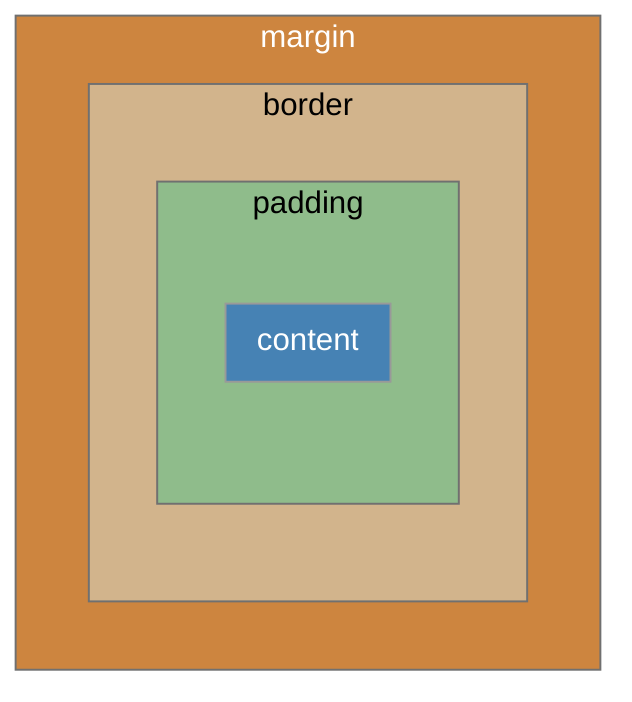
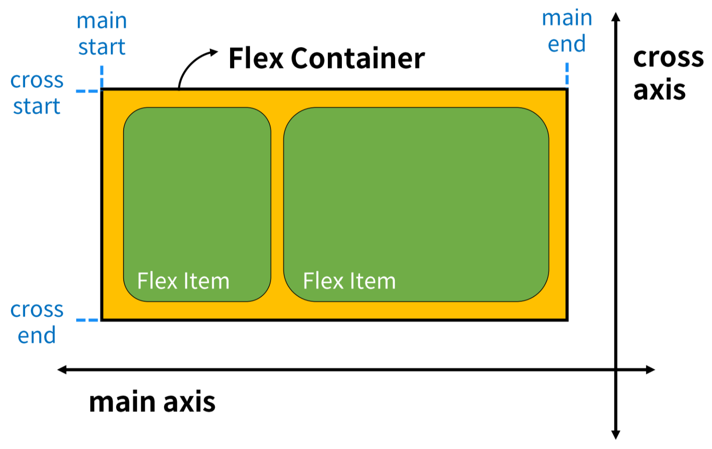

# CSS
- **C**ascading **S**tyle **S**heet
- 웹 페이지의 디자인과 레이아웃을 구성하는 언어

## CSS 적용방법
## Inline
```html
<!DOCTYPE html>
<html lang="en">
<head>
...
</head>
<body>
  <h1 style="color:#FFF700; background-color:#003153;">Hello, there.</h1>
</body>
```

## Internal
```html
<!DOCTYPE html>
<html lang="en">
<head>
...
  <title>Obi-Wan met R2-D2</title>
  <style>
    h1 {
        color:#FFF700;
        background-color:#003153;
    }
  </style>
</head>
<body>
  <h1>Hello, there.</h1>
</body>
```


## External
```html
<!DOCTYPE html>
<html lang="en">
<head>
...
  <link rel="stylesheet" href="style.css">
  <title>Obi-Wan met R2-D2</title>
</head>
<body>
  <h1>Hello, there.</h1>
</body>
```
```css
/* style.css*/
h1 {
  color:#FFF700;
  background-color:#003153;
}
```
<br><br>

# CSS Selectors
- HTML 요소를 선택하여 스타일을 적용할 수 있게 한다.

## CSS Selectors 종류
- 기본 선택자
  - 전체(`*`) 선택자
  - 요소(`tag`) 선택자
  - 클래스(`class`) 선택자
  - 아이디(`id`) 선택자
  - 속성(`attr`) 선택자
- 결합자(Combinators)
  - 자손결합자(` `)
  - 자식 결합자(`>`)

## CSS Selectors 특징
- 요소 선택자: 지정한 모든 태그를 선택한다.
- 클래스 선택자
  - 주어진 클래스 속성을 가진 모든 요소를 선택한다.
  - ex) `.index`는 `class="index"`를 가진 모든 요소를 선택한다.
- 아이디 선택자
  - 주어진 아이디 속성을 가진 요소를 선택한다.
  - 문서에는 주어진 아이디를 가진 요소가 하나만 있어야 한다.
  - ex) `#index`는 `id="index"`를 가진 요소를 선택한다.
- 자손 선택자(The space combinator)
  - 첫 번째 요소의 자손 요소들을 선택한다.
  - ex) `p span`은 `<p>` 안에 있는 모든 `<span>`을 선택한다.
- 자식 선택자
  - 첫 번째 요소의 직계 자식만 선택한다.
  - ex) `ul > li`는 `<ul>` 안에 있는 모든 `li`를 선택한다.

# Cascade & Specificity
## Cascade
- 동일한 우선순위를 가지는 규칙이 적용될 때 마지막에 나오는 규칙이 적용된다.
- 아래 예시의 경우: `blue`가 적용된다.
```CSS
h1 {
  color:red;
}

h1 {
  color:blue;
}
```

## Specificity
- 선택자 별로 정해진 우선순위에 따라 높은 우선순위를 가지는 규칙이 적용된다.
- 아래 예시의 경우: `red`가 적용된다.
```CSS
.make-red {
  color:red;
}

h1 {
  color:blue;
}
```

### 우선순위
1. Importance: `!important`
  - 반드시 필요한 경우가 아니라면 사용하지 않는 게 낫다.
2. 인라인 > id 선택자 > class 선택자 > 요소 선택자
3. 소스코드 순서

## 상속
- 기본적으로 CSS는 상속을 통해 부모 요소의 속성을 자식에게 상속한다.
- 이를 통해 코드의 재사용성을 높인다.
- 상속되는 속성
  - 텍스트 관련 요소(font, color, text-align)
  - opacity
  - visibility 등
- 상속되지 않는 속성
  - Box model 관련 요소(width, height, margin, padding, border, box-sizing, display)
  - position 관련 요소(position, top/right/bottom/left, z-index) 등
<br><br>

# CSS Box Model
- 모든 HTML 요소를 사각형으로 표현한다.
- 박스에 대한 크기, 여백, 테두리 등의 스타일을 지정하는 디자인 개념

## Box의 구성

- Margin: 박스와 다른 요소 사이의 공백. 가장 바깥 영역
- Border: 콘텐츠와 패딩을 감싸는 테두리 영역
- Padding: 콘텐츠 주위에 위치하는 공백 영역
- Content: 콘텐츠가 표시되는 영역

## Width, Height
- 요소의 너비와 높이를 지정한다.
- 이때 지정되는 요소의 너비와 높이는 콘텐츠 영역을 대상으로 한다.
<br><br>

# 박스 타입
## Normal Flow
CSS를 적용하지 않았을 경우 Block 및 Inline 요소가 기본적으로 배치되는 방향
- Block: 위에서 아래
- Inline: 왼쪽에서 오른쪽

## Block Type 특징
- 항상 새로운 행으로 나뉜다.
- width와 height 속성을 사용하여 너비와 높이를 지정할 수 있다.
- 기본적으로 width 속성을 지정하지 않으면 박스는 inline 방향으로 사용 가능한 공간을 모두 차지한다.
  - 너비를 사용 가능한 공간의 100%로 채운다.
- 대표적인 block 타입 태그: `h1~6`, `p`, `div`

## Inline Type 특징
- 새로운 행으로 나뉘지 않는다.
- width와 height 속성을 사용할 수 없다.
- 수직 방향
  - padding, margin, borders가 적용되지만 다른 요소를 밀어낼 수는 없다.
- 수평 방향
  - padding, margin, borders가 적용되고 다른 요소를 밀어낼 수 있다.
- 대표적인 inline 타입 태그: `a`, `img`, `span`
<br><br>

# CSS Layout
각 요소의 위치와 크기를 조정하여 웹 페이지의 디자인을 결정하는 것
<br><br>

# CSS Position
Normal Flow에서 요소를 꺼내 다른 위치로 배치하는 것<br>
다른 요소 위에 놓기, 화면 특정 위치에 고정시키기 등

## Position 유형
$\texttt{static, relative, absolute, fixed, sticky}$

## Position 유형별 특징
- $\texttt{static}$
  - 기본값
  - 요소를 Normal Flow에 따라 배치한다.
- $\texttt{relative}$
  - 요소를 Normal Flow에 따라 배치한다.
  - 자기 자신을 기준으로 이동한다.
  - 요소가 차지하는 공간은 $\texttt{static}$일 때와 같다.
- $\texttt{absolute}$
  - 요소를 Normal Flow에서 제거한다.
  - 가장 가까운 $\texttt{relative}$ 요소를 기준으로 이동.한다
  - 문서에서 요소가 차지하는 공간이 없어진다.
- $\texttt{fixed}$
  - 요소를 Normal Flow에서 제거한다.
  - 현재 화면영역(viewport)을 기준으로 이동한다.
  - 문서에서 요소가 차지하는 공간이 없어진다.
- $\texttt{sticky}$
  - 요소를 Normal Flow에 따라 배치한다.
  - 가장 가까운 block 요소를 기준으로 이동한다.
  - 요소가 특정 임계점에 스크롤될 때 그 위치에서 고정된다.
  - 만약 다음 $\texttt{sticky}$ 요소가 나오면 다음 $\texttt{sticky}$ 요소가 이전 $\texttt{sticky}$ 요소의 자리를 대체한다.
    - 이전 $\texttt{sticky}$ 요소가 고정되어 있던 위치와 다음 $\texttt{sticky}$ 요소가 고정되어야 할 위치가 겹치게 되기 때문이다.

## z-index
요소가 겹쳤을 때 어떤 요소 순으로 위에 나타낼지 결정한다.
- 정수 값을 사용해 Z축 순서를 지정한다.
- 더 큰 값을 가진 요소가 작은 값의 요소를 덮는다.
<br><br>

# Float
- 요소를 띄워 텍스트 및 인라인 요소가 그 주위를 감사도록 하는 배치
- 텍스트 열 내부에 떠다니는 이미지를 포함하면서도 해당 이미지의 좌우에 텍스트를 둘러싸는 간단한 레이아웃을 구현하기 위해 도입되었다.
<br><br>

# Flexbox
요소를 행과 열 형태로 배치하는 1차원 레이아웃 방식

## Flexbox 기본 사항


- main axis
  - flex item이 배치되는 기본 축
  - main start에서 시작하여 main end 방향으로 배치한다.
- cross axis
  - main axis에 수직인 축
  - cross start에서 시작하여 cross end 방향으로 배치한다.
- Flex Container
  - $\texttt{display}$: $\texttt{flex;}$ 혹은 $\texttt{display: inline-flex;}$가 설정된 부모 요소
  - 이 컨테이너의 1차 자식 요소들이 Flex Item이 된다.
  - Flexbox 속성 값들을 사용하여 자식 요소 Flex Item을 배치한다.
- Flex Item
  - Flex Container 내부에 레이아웃 되는 항목

## Flexbox 속성
- Flex Container 관련 속성<br>
$\texttt{display}$, $\texttt{flex-direction}$, $\texttt{flex-wrap}$, $\texttt{justify-content}$, $\texttt{align-items}$, $\texttt{align-content}$
- Flex Item 관련 속성<br>
$\texttt{align-self}$, $\texttt{flex-grow}$, $\texttt{flex-shrink}$, $\texttt{flex-basis}$, $\texttt{order}$

### Flex Container 지정
```css
.container {
  height: 500px;
  border: 1px solid black;
  display: flex;
}
```
- flex item은 행으로 나열된다.
- flex item은 주축의 시작 선에서 시작한다.
- flex item은 교차축의 크기를 채우기 위해 늘어난다.

### flex-direction 지정
```css
.container {
	/* flex-direction: row; */
	flex-direction: column;
	/* flex-direction: row-reverse; */
	/* flex-direction: column-reverse; */
}
```
- flex item이 나열되는 방향을 지정한다.
- column으로 지정할 경우 주축이 변경된다.
- -reverse로 지정할 경우 시작 선과 끝 선이 서로 바뀐다.

### flex-wrap
```css
.container {
	/* flex-wrap: nowrap; */
	flex-wrap: wrap;
}
```
flex item 목록이 flex container의 하나의 행에 들어가지 않을 경우 다른 행에 배치할지 여부를 설정한다.

### justify-content
```css
.container {
	/* justify-content: flex-start; */
	justify-content: center;
	/* justify-content: flex-end; */
}
```
주축을 따라 flex item과 주위에 공간을 분배한다.

### align-content
```css
.container {
	flex-wrap: wrap;

	/* align-content: flex-start; */
	align-content: center;
	/* align-content: flex-end; */
}
```
- 교차축을 따라 flex item과 주위에 공간을 분배한다.
- flex-wrap이 wrap 또는 wrap-reverse로 설정된 여러 행에만 적용된다.
- 한 줄자리 행에는 (flex-wrap이 nowrap으로 설정된 경우) 효과가 없다.

### align-items
```css
.container {
	align-items: center;
}
```
교차축을 따라 flex item 행을 정렬한다.

### align-self
```css
.item1 {
	align-self: center;
}

.item2 {
	align-self: flex-end;
}
```
교차축을 따라 개별 flex item을 정렬한다.

### flex-grow
```css
.item1 {
	flex-grow: 1;
}

.item2 {
	flex-grow: 2;
}

.item3 {
	flex-grow: 3;
}
```
- 남는 행 여백을 비율에 따라 각 flex item에 분배한다.
- flex-grow의 반대는 flex-shrink: 넘치는 너비를 분배해 줄인다.

### flex-basis
```css
.item1 {
	flex-basis: 300px;
}

.item2 {
	flex-basis: 600px;
}

.item3 {
	flex-basis: 300px;
}
```

## 목적에 따른 분류
- 배치 설정
	- $\texttt{flex-direction}$
	- $\texttt{flex-wrap}$
- 공간 분배
	- $\texttt{justify-content}$
	- $\texttt{align-content}$
- 정렬
	- $\texttt{align-items}$
	- $\texttt{align-self}$